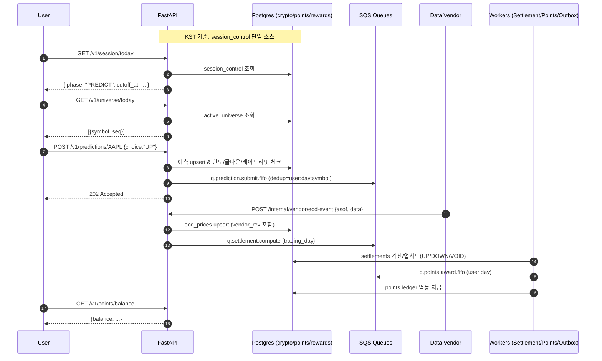

# 미국주식 O/X 예측 서비스 — 종합 기획·설계 문서 (원문 + 확장)

> 본 문서는 사용자가 제공한 **원문 사양**을 보존·통합하고, 기획자/개발자가 한 번에 이해·구현할 수 있도록 **API 명세**, **아키텍처**, **데이터 모델(DDL)**, **워커 의사코드**, **운영 대시보드**, **테스트/보안/운영**까지 한 문서에 정리했습니다. 물리 스키마명은 요구사항대로 `crypto` 고정, 시간대는 **KST** 기준으로 운영/저장합니다.

---

## 0) 한눈에 요약 (Executive Summary)

- **서비스**: 미국 주식 종목에 대해 **O/X(상승/하락) 예측** 참여 → **정산 후 포인트 지급** → **리워드 교환**.
- **핵심 UX**: 매일 선정된 약 **10개 종목**에 대해 **장 마감 직후\~다음 개장 직전** 예측 접수(**PREDICT**). **장 마감 후 EOD 확정** 시 **정산/포인트 지급(****SETTLE****)**.
- **세션(2단계)**: `PREDICT`(예측접수) / `SETTLE`(정산/포인트). 컷오프=개장.
- **기술 스택**: FastAPI, PostgreSQL(`crypto.*`, `points.*`, `rewards.*`), **SQS**, S3(선택), **Redis 없음**.
- **일일 흐름(KST)**: (1) 오늘의 종목 10 선정 → (2) 마감 직후 예측 오픈 → (3) 개장 시 컷오프 → (4) 마감 후 EOD 수신 → (5) 정산 → (6) 포인트 지급 → (7) 리워드 교환.
- **사용자 성장**: 광고 시청 또는 **5/10분 쿨다운**으로 **추가 예측 슬롯** 획득.

---

## 1) 용어 쉬운말 변환표 (UX 표기 기준)

| 기존 용어                        | 쉬운 용어(서비스 표기) | 설명                            |
| ---------------------------- | ------------- | ----------------------------- |
| Trading Day                  | 거래일           | KST 기준 하루 단위 운영 날짜            |
| Session (PREDICT/SETTLE)     | 예측 시간/정산 시간   | 개장 전 예측 접수 / 마감 후 정산 및 포인트 지급 |
| Active Universe              | 오늘의 종목 10     | 오늘 참여 가능한 약 10개 종목 목록         |
| Prediction                   | 예측            | 종목별 상승/하락 선택 기록               |
| Settlement                   | 정산 결과         | EOD 기준 상승/하락/무효(VOID) 판정      |
| EOD Prices                   | 종가 스냅샷        | 마감가격/전일종가 및 정정 리비전 포함         |
| Outcome                      | 예측 결과 값       | UP / DOWN / VOID              |
| Vendor EOD Webhook           | 종가 확정/정정 알림   | 외부 데이터 공급사 EOD/정정 이벤트         |
| Points Ledger/Hold           | 포인트 내역/보류     | 지급/차감 원장, 리워드 결제 보류(Saga 상태)  |
| Rewards Inventory/Redemption | 리워드/교환        | 포인트 교환 상품과 교환 프로세스            |
| Outbox                       | 이벤트 발행함       | DB→SQS 발행용 테이블(멱등/재시도)        |

> 내부 물리 스키마/테이블명은 `crypto` 유지, 사용자-facing 문구는 위 쉬운 용어 사용.

---

## 2) 상위 아키텍처 개요

- **FastAPI 모듈**: auth/users, rounds/predictions, points, rewards, admin, market(etl), ai(optional)
- **DB**: PostgreSQL (`crypto.*`, `points.*`, `rewards.*`, `public.outbox`)
- **큐**: SQS (`q.prediction.submit.fifo`, `q.settlement.compute`, `q.points.award.fifo`, `q.rewards.saga`, `q.outbox.publisher`)
- **배치**: EventBridge/CloudWatch 스케줄
- **운영 시간대**: KST, 안내 문구로 고정 표기(개장 22:30/23:30, 마감 05:00/06:00)

---

## 3) 시나리오(사용자 제공 요구 반영)

- **마켓 종료 → 다음 시작 전**: 예측 서비스 **시작(PREDICT)**
- **마켓 시작**: 예측 서비스 **종료(컷오프)**
- **마켓 종료**: 유저 예측에 대한 **정산 Batch 시작**
- **정산 Batch 종료 후**: **성공 유저 포인트 지급**
- **리워드**: 유저는 **포인트로 리워드 교환** 가능
- **추가 예측 기회**: 광고 시청 또는 **5/10분 쿨다운** 경과 시 **다른 종목 추가 예측** 가능

---

## 4) 엔드포인트 맵 & 핵심 플로우 (Mermaid)

### 4.1 기능 영역별 엔드포인트 맵

```mermaid
graph LR
  subgraph Auth/Users
    A1[POST /v1/auth/signup]
A2[POST /v1/auth/login]
A3[GET /v1/users/me]
  end
  subgraph Session
    S1[GET /v1/session/today]
S2[POST /internal/session/flip-to-predict]
S3[POST /internal/session/cutoff]
  end
  subgraph Universe
    U1[GET /v1/universe/today]
U2[POST /internal/universe/upsert]
  end
  subgraph Predictions
    P1[POST /v1/predictions/{symbol}]
P2[GET /v1/settlements/{trading_day}]
  end
  subgraph Points
    PL1[GET /v1/points/balance]
PL2[GET /v1/points/ledger]
  end
  subgraph Rewards
    R1[GET /v1/rewards/catalog]
R2[POST /v1/rewards/redeem]
  end
  subgraph Market/ETL
    M1[POST /internal/vendor/eod-event]
M2[POST /internal/settlement/run]
  end
  subgraph Growth/Ads
    G1[POST /v1/ads/unlock]
G2[GET /v1/ads/status]
  end
  subgraph Admin
    AD1[GET /admin/dashboard]
AD2[POST /admin/rewards/inventory]
AD3[POST /admin/users/adjust-points]
  end
  A1 --> A3
  S1 --> U1
  U1 --> P1
  M1 --> M2
  M2 --> P2
  P2 --> PL1
  PL1 --> R2
  R1 --> R2
  G1 --> P1
```

### 4.2 예측→정산→포인트 시퀀스



### 4.3 리워드 교환 Saga

```mermaid
sequenceDiagram
  autonumber
  participant User
  participant API
  participant DB
  participant SQS
  participant Vendor

  User->>API: POST /v1/rewards/redeem {sku, cost_points}
  API->>DB: points.holds INSERT (OPEN)
  API->>SQS: q.rewards.saga {redeem_id}
  API-->>User: 202 Accepted

  SQS->>API: Worker handle(redeem_id)
  API->>DB: rewards.inventory.reserve
  API->>Vendor: issue code
  Vendor-->>API: vendor_code
  API->>DB: points.ledger debit & holds→COMMITTED; redemptions→ISSUED
  API->>DB: outbox 기록 → SQS 발행

  Note over API,Vendor: 실패 시 보상거래로 복원
```

---

## 5) API 상세 명세 (요약) — 클라이언트/서버 공통 규칙 포함

- 인증: JWT Bearer, 멱등키 `Idempotency-Key` 지원(선택)
- 시간대: 모든 타임스탬프 KST ISO8601
- 오류 포맷 표준화(`error.code/message/details`), 429 레이트리밋

> **세부 스펙/예시 페이로드**는 하단 "부록 A — API 상세 스펙 전체"에 원문 그대로 포함했습니다.

---

## 6) 데이터 모델 — **원문 DDL (요청사항 보존)**

> 아래는 사용자가 제공한 핵심 테이블 & DDL을 **그대로** 보존합니다. 스키마명은 `crypto` 고정.

```sql
-- 2-Phase 세션 컨트롤
CREATE TYPE crypto.phase AS ENUM ('PREDICT', 'SETTLE');

CREATE TABLE IF NOT EXISTS crypto.session_control (
  trading_day date PRIMARY KEY,
  phase crypto.phase NOT NULL,
  predict_open_at timestamptz NOT NULL,
  predict_cutoff_at timestamptz NOT NULL,
  settle_ready_at timestamptz,
  settled_at timestamptz,
  created_at timestamptz DEFAULT now(),
  updated_at timestamptz DEFAULT now()
);

-- 당일 참여 유니버스(~10)
CREATE TABLE IF NOT EXISTS crypto.active_universe (
  trading_day date NOT NULL,
  symbol text NOT NULL,
  seq smallint NOT NULL,
  PRIMARY KEY (trading_day, symbol)
);

-- 예측
CREATE TYPE crypto.choice AS ENUM ('UP','DOWN');

CREATE TABLE IF NOT EXISTS crypto.predictions (
  id bigserial PRIMARY KEY,
  trading_day date NOT NULL,
  user_id bigint NOT NULL,
  symbol text NOT NULL,
  choice crypto.choice NOT NULL,
  submitted_at timestamptz NOT NULL DEFAULT now(),
  locked_at timestamptz,
  UNIQUE (trading_day, user_id, symbol)
);

-- 정산 결과
CREATE TYPE crypto.outcome AS ENUM ('UP','DOWN','VOID');

CREATE TABLE IF NOT EXISTS crypto.settlements (
  trading_day date NOT NULL,
  symbol text NOT NULL,
  outcome crypto.outcome NOT NULL,
  close_price numeric(18,6) NOT NULL,
  prev_close_price numeric(18,6) NOT NULL,
  computed_at timestamptz NOT NULL DEFAULT now(),
  PRIMARY KEY (trading_day, symbol)
);

-- EOD 스냅샷(정정 리비전 포함)
CREATE TABLE IF NOT EXISTS crypto.eod_prices (
  asof date NOT NULL,
  symbol text NOT NULL,
  close_price numeric(18,6) NOT NULL,
  prev_close_price numeric(18,6) NOT NULL,
  vendor_rev int NOT NULL DEFAULT 0,
  PRIMARY KEY (asof, symbol, vendor_rev)
);

-- 포인트 원장(멱등)
CREATE TABLE IF NOT EXISTS points.ledger (
  id bigserial PRIMARY KEY,
  user_id bigint NOT NULL,
  trading_day date,
  symbol text,
  delta_points bigint NOT NULL,
  reason text NOT NULL,
  ref_type text NOT NULL,
  ref_id text NOT NULL,
  balance_after bigint NOT NULL,
  created_at timestamptz DEFAULT now(),
  UNIQUE (ref_type, ref_id)
);

-- 포인트 보류(Hold) - Saga 중간상태
CREATE TYPE points.hold_status AS ENUM ('OPEN','COMMITTED','CANCELLED');

CREATE TABLE IF NOT EXISTS points.holds (
  id bigserial PRIMARY KEY,
  user_id bigint NOT NULL,
  amount bigint NOT NULL,
  reason text NOT NULL,
  ref_type text NOT NULL,
  ref_id text NOT NULL,
  status points.hold_status NOT NULL DEFAULT 'OPEN',
  created_at timestamptz DEFAULT now(),
  UNIQUE (ref_type, ref_id)
);

-- 리워드 인벤토리/교환 + 아웃박스
CREATE TABLE IF NOT EXISTS rewards.inventory (
  sku text PRIMARY KEY,
  title text NOT NULL,
  stock int NOT NULL,
  reserved int NOT NULL DEFAULT 0,
  vendor text NOT NULL
);

CREATE TYPE rewards.redemption_status AS ENUM ('REQUESTED','RESERVED','ISSUED','CANCELLED','FAILED');

CREATE TABLE IF NOT EXISTS rewards.redemptions (
  id bigserial PRIMARY KEY,
  user_id bigint NOT NULL,
  sku text NOT NULL REFERENCES rewards.inventory(sku),
  cost_points int NOT NULL,
  status rewards.redemption_status NOT NULL,
  vendor_code text,
  created_at timestamptz DEFAULT now()
);

CREATE TABLE IF NOT EXISTS public.outbox (
  id bigserial PRIMARY KEY,
  topic text NOT NULL,
  payload jsonb NOT NULL,
  published boolean NOT NULL DEFAULT false,
  created_at timestamptz DEFAULT now()
);
```

### 6.1 추가 인덱스/보조 테이블(확장 제안)

```sql
CREATE INDEX IF NOT EXISTS idx_session_control_phase ON crypto.session_control(phase);
CREATE INDEX IF NOT EXISTS idx_session_predict_cutoff ON crypto.session_control(predict_cutoff_at);
CREATE INDEX IF NOT EXISTS idx_predictions_user_day ON crypto.predictions(user_id, trading_day);
CREATE INDEX IF NOT EXISTS idx_settlements_day ON crypto.settlements(trading_day);
CREATE INDEX IF NOT EXISTS idx_eod_prices_asof_symbol ON crypto.eod_prices(asof, symbol);

CREATE TABLE IF NOT EXISTS crypto.user_limits (
  user_id bigint PRIMARY KEY,
  day date NOT NULL,
  base_slots smallint NOT NULL DEFAULT 3,
  ad_slots_used smallint NOT NULL DEFAULT 0,
  ad_slots_max smallint NOT NULL DEFAULT 7,
  used_slots smallint NOT NULL DEFAULT 0,
  cooldown_until timestamptz,
  updated_at timestamptz DEFAULT now()
);

CREATE TABLE IF NOT EXISTS crypto.ad_unlocks (
  id bigserial PRIMARY KEY,
  user_id bigint NOT NULL,
  trading_day date NOT NULL,
  method text NOT NULL, -- 'AD' | 'COOLDOWN'
  unlocked_slots smallint NOT NULL DEFAULT 1,
  created_at timestamptz DEFAULT now()
);

CREATE TABLE IF NOT EXISTS crypto.rate_limits (
  key text NOT NULL,
  count int NOT NULL DEFAULT 0,
  expire_at timestamptz NOT NULL,
  PRIMARY KEY(key)
);

CREATE INDEX IF NOT EXISTS idx_outbox_published ON public.outbox(published, created_at);
```

---

## 7) 세션 모델(2-Phase)

- `PREDICT`: **시장 종료 후 → 다음 개장 직전** (컷오프=개장)
- `SETTLE`: **장 마감 후** EOD 확정 → 정산/포인트 지급 (정정 시 T+1 보상거래)

---

## 8) 이벤트/큐(SQS) 설계

- `q.prediction.submit.fifo` (dedup: `user:day:symbol`)
- `q.settlement.compute` (payload `{ trading_day }`)
- `q.points.award.fifo` (dedup: `user:day`)
- `q.rewards.saga` (redeem/compensate)
- `q.outbox.publisher` (DB outbox→SQS)
- 각 큐별 DLQ, 멱등키는 DB `UNIQUE(ref_type,ref_id)`로 보강

---

## 9) 배치/스케줄(KST)

- **매일**: `active_universe` 선정/업서트
- **개장 종료 후 \~ 다음 개장 직전**: `PREDICT` 오픈
- **개장 시각**: 예측 서비스 컷오프
- **장 마감 후**: EOD 확정 수신 → 정산 → 포인트 지급
- **서머타임 고정 안내**: 개장 22:30/23:30, 마감 05:00/06:00 (운영 문구)

---

## 10) 포인트 정책/멱등성

- 승리 +N, 패배 0, VOID 0 (N=환경변수)
- 멱등: `points.ledger UNIQUE(ref_type,ref_id)` + 워커에서 advisory lock(ref\_id)

---

## 11) 리워드 교환 Saga(발급/취소)

- 단계: **hold(OPEN) → inventory.reserve → vendor.issue → ledger.debit & hold COMMITTED → ISSUED**
- 보상: **vendor.revoke → inventory.release → ledger.credit & hold CANCELLED → CANCELLED/FAILED**
- Outbox로 전 단계 이벤트 기록/발행

---

## 12) Redis 없는 운영 전략

- **캐시/조회**: Postgres 인덱스 + `DISTINCT ON`, 리더보드/집계는 스냅샷 테이블 또는 머뷰 concurrent refresh
- **락/중복**: Postgres Advisory Lock + UNIQUE 제약
- **Pub/Sub**: Outbox 폴링 후 SQS 발행
- **레이트리밋**: 분/시간 버킷 카운터 테이블
- **지연/재시도**: SQS `DelaySeconds`/`VisibilityTimeout` + DLQ

---

## 13) FastAPI 라우터 스텁 (Pydantic 포함)

> 실제 구현은 DB/SQS 바인딩 지점에 `TODO` 표기. 개발 착수 템플릿.

```python
# app/main.py
from fastapi import FastAPI
from app.routers import auth, session, universe, predictions, settlements, points, rewards, ads, internal, admin

app = FastAPI(title="US Stocks O/X Prediction API", version="0.1.0")

app.include_router(auth.router, prefix="/v1/auth", tags=["auth"])
app.include_router(session.router, prefix="/v1/session", tags=["session"])
app.include_router(universe.router, prefix="/v1/universe", tags=["universe"])
app.include_router(predictions.router, prefix="/v1/predictions", tags=["predictions"])
app.include_router(settlements.router, prefix="/v1/settlements", tags=["settlements"])
app.include_router(points.router, prefix="/v1/points", tags=["points"])
app.include_router(rewards.router, prefix="/v1/rewards", tags=["rewards"])
app.include_router(ads.router, prefix="/v1/ads", tags=["ads"])
app.include_router(internal.router, prefix="/internal", tags=["internal"])
app.include_router(admin.router, prefix="/admin", tags=["admin"])
```

```python
# app/schemas/common.py
from pydantic import BaseModel
from typing import Optional

class Error(BaseModel):
    code: str
    message: str
    details: Optional[dict] = None

class ApiError(BaseModel):
    error: Error
```

```python
# app/routers/session.py
from fastapi import APIRouter
from pydantic import BaseModel
from typing import Optional

router = APIRouter()

class SessionToday(BaseModel):
    trading_day: str
    phase: str  # PREDICT | SETTLE
    predict_open_at: str
    predict_cutoff_at: str
    settled_at: Optional[str]

@router.get("/today", response_model=SessionToday)
async def get_today_session():
    return SessionToday(
        trading_day="2025-08-18",
        phase="PREDICT",
        predict_open_at="2025-08-18T06:05:00+09:00",
        predict_cutoff_at="2025-08-18T22:30:00+09:00",
        settled_at=None,
    )
```

```python
# app/routers/universe.py
from fastapi import APIRouter
from pydantic import BaseModel
from typing import List

router = APIRouter()

class Item(BaseModel):
    symbol: str
    seq: int

@router.get("/today", response_model=List[Item])
async def list_today_universe():
    return [Item(symbol="AAPL", seq=1), Item(symbol="MSFT", seq=2)]
```

```python
# app/routers/predictions.py
from fastapi import APIRouter, Header, HTTPException, status
from pydantic import BaseModel, Field
from typing import Optional

router = APIRouter()

class PredictReq(BaseModel):
    choice: str = Field(pattern="^(UP|DOWN)$")

class PredictAccepted(BaseModel):
    status: str = "accepted"
    trading_day: str
    symbol: str

@router.post("/{symbol}", response_model=PredictAccepted, status_code=status.HTTP_202_ACCEPTED)
async def submit_prediction(symbol: str, body: PredictReq, idempotency_key: Optional[str] = Header(default=None, alias="Idempotency-Key")):
    if symbol.upper() not in ("AAPL", "MSFT"):
        raise HTTPException(status_code=404, detail="symbol not in today's list")
    return PredictAccepted(trading_day="2025-08-18", symbol=symbol.upper())
```

```python
# app/routers/settlements.py
from fastapi import APIRouter
from pydantic import BaseModel
from typing import List

router = APIRouter()

class SettlementRow(BaseModel):
    trading_day: str
    symbol: str
    outcome: str  # UP | DOWN | VOID
    close_price: str
    prev_close_price: str

@router.get("/{trading_day}", response_model=List[SettlementRow])
async def get_settlements(trading_day: str):
    return []
```

```python
# app/routers/points.py
from fastapi import APIRouter
from pydantic import BaseModel
from typing import List, Optional

router = APIRouter()

class Balance(BaseModel):
    balance: int

class LedgerRow(BaseModel):
    id: int
    trading_day: Optional[str]
    symbol: Optional[str]
    delta_points: int
    reason: str
    ref_type: str
    ref_id: str
    balance_after: int
    created_at: str

@router.get("/balance", response_model=Balance)
async def get_balance():
    return Balance(balance=0)

@router.get("/ledger", response_model=List[LedgerRow])
async def get_ledger(limit: int = 50):
    return []
```

```python
# app/routers/rewards.py
from fastapi import APIRouter, status
from pydantic import BaseModel
from typing import List

router = APIRouter()

class CatalogItem(BaseModel):
    sku: str
    title: str
    cost_points: int
    stock: int

class RedeemReq(BaseModel):
    sku: str
    cost_points: int

class RedeemAccepted(BaseModel):
    status: str = "accepted"
    redemption_id: int

@router.get("/catalog", response_model=List[CatalogItem])
async def list_catalog():
    return []

@router.post("/redeem", response_model=RedeemAccepted, status_code=status.HTTP_202_ACCEPTED)
async def redeem(req: RedeemReq):
    return RedeemAccepted(redemption_id=12345)
```

```python
# app/routers/ads.py
from fastapi import APIRouter
from pydantic import BaseModel
from typing import Optional

router = APIRouter()

class AdsStatus(BaseModel):
    can_unlock: bool
    cooldown_min: int
    today: dict
    cooldown_until: Optional[str]

class UnlockReq(BaseModel):
    method: str  # AD | COOLDOWN

class UnlockRes(BaseModel):
    unlocked_slots: int
    used_slots: int
    ad_slots_used: int

@router.get("/status", response_model=AdsStatus)
async def status():
    return AdsStatus(can_unlock=True, cooldown_min=5, today={"base_slots":3, "used_slots":0, "ad_slots_used":0, "ad_slots_max":7}, cooldown_until=None)

@router.post("/unlock", response_model=UnlockRes)
async def unlock(req: UnlockReq):
    return UnlockRes(unlocked_slots=1, used_slots=0, ad_slots_used=1)
```

```python
# app/routers/internal.py
from fastapi import APIRouter, status

router = APIRouter()

@router.post("/session/flip-to-predict", status_code=status.HTTP_204_NO_CONTENT)
async def flip_to_predict():
    return

@router.post("/session/cutoff", status_code=status.HTTP_204_NO_CONTENT)
async def cutoff():
    return

@router.post("/settlement/run", status_code=status.HTTP_202_ACCEPTED)
async def run_settlement(trading_day: dict):
    return

@router.post("/vendor/eod-event", status_code=status.HTTP_202_ACCEPTED)
async def eod_event(payload: dict):
    return
```

```python
# app/routers/admin.py
from fastapi import APIRouter, status

router = APIRouter()

@router.get("/dashboard")
async def dashboard():
    return {"dau": 0}

@router.post("/rewards/inventory", status_code=status.HTTP_204_NO_CONTENT)
async def upsert_inventory(item: dict):
    return

@router.post("/users/adjust-points", status_code=status.HTTP_204_NO_CONTENT)
async def adjust_points(payload: dict):
    return
```

---

## 14) 워커 & 배치 의사코드 (멱등 설계)

### 14.1 Settlement Compute Worker

```text
Trigger: SQS q.settlement.compute {trading_day}
1) tx begin (read committed)
2) rows = SELECT * FROM crypto.eod_prices WHERE asof=:day AND vendor_rev = (최신)
3) FOR each symbol IN 오늘의 종목 10:
   - outcome = sign(close - prev) → 'UP'|'DOWN'|'VOID'
   - UPSERT crypto.settlements (PK: trading_day,symbol)
4) tx commit
5) enqueue q.points.award.fifo for affected users (dedup=user:day)
```

### 14.2 Points Award Worker

```text
Trigger: q.points.award.fifo {user_id, trading_day}
1) advisory_lock("user:{user_id}:{day}")
2) JOIN predictions×settlements
3) win_cnt × POINTS_WIN_REWARD → delta
4) points.ledger INSERT (UNIQUE(ref_type,ref_id))
5) unlock
```

### 14.3 Rewards Saga Worker

```text
1) holds==OPEN 확인 → inventory.reserve → vendor.issue
2) ledger.debit 멱등 → holds→COMMITTED → redemptions→ISSUED → outbox 기록
3) 실패 시 revoke/release/credit 보상거래
```

### 14.4 Outbox Publisher

```text
Loop: SELECT published=false → SQS 발행 → published=true 업데이트
지표: lag(ms), 미발행 건수
```

### 14.5 Rate Limit GC / Universe 배치

```text
분/시간 버킷 만료 삭제, 일일 Top10 업서트(백업: 전일 목록 재사용)
```

---

## 15) 운영 대시보드 요구사항

- **KPI**: DAU, 예측자 수, 제출수, 승률, VOID율, 포인트 발급 합, 리워드 전환율, 광고 완료율, 큐 적체, Outbox 지연
- **차트**: 시간대별 제출 히트맵, 종목별 참여/승률 Top10, 정정 발생/영향 포인트, 레이트리밋 상위
- **알람**: 정산 지연, outbox 미발행, DLQ 유입, EOD 미수신, 리워드 오류율 급증
- **운영 액션**: 오늘의 종목 10 수동 조정, 리워드 재고/CSV, 사용자 포인트 조정, 정산 강제 실행
- **보안/Audit**: 관리자 행위 로깅, Webhook 서명 검증, JWT 키순환, MFA/권한 롤
- **SLO/런북**: 예측 API p99<300ms, 정산 T+15분, Outbox p95<30s / 큐 적체 대응·DLQ 재처리·벤더 장애시 CSV 수동정산

---

## 16) 테스트 플랜

1. 세션 전환(서머타임/경계)
2. 예측 제출(컷오프/중복/슬롯/쿨다운/레이트리밋)
3. 정산 정확성 및 멱등(UP/DOWN/VOID)
4. 정정(T+1) 보상거래(+/−)
5. 리워드 Saga(성공/실패/취소)
6. 큐/DLQ 재처리 멱등
7. 보안(토큰 위조/광고 콜백 위조/권한)

---

## 17) 보안/컴플라이언스 가이드

- 포인트는 현금가치 없음(약관), 투자자문 아님 고지, 월간 교환 상한/1인 한도
- 연령/지역 제한, KYC/제재국가 필터(필요 시)
- 개인정보 최소 수집, 관리자 MFA, 권한 분리, Audit Trail 전면 적용

---

## 18) 개발 로드맵(권장)

- **MVP**: 인증/유저, 세션·유니버스 조회, 예측 제출, 수동 EOD 트리거 정산, 포인트 지급, 리워드(모의), Outbox 퍼블리셔, DLQ 세팅
- **M1**: 광고 연동(서버사이드 검증), 관리자 대시보드, 실벤더/레이트리밋/통계
- **M2**: 리더보드/친구초대, 부정사용 탐지 룰, A/B 테스트, ML 기반 종목 큐레이션

---

## 부록 A — API 상세 스펙 전체(요청+확장)

> 본 섹션은 클라이언트 개발자가 바로 붙일 수 있도록 엔드포인트/예제 응답을 일괄 제공.

### Auth / Users

- `POST /v1/auth/signup` → `{ user_id, token, nickname }`
- `POST /v1/auth/login` → `{ user_id, token, nickname }`
- `GET /v1/users/me` → `{ user_id, email, nickname }`

### Session

- `GET /v1/session/today` → `{ trading_day, phase, predict_open_at, predict_cutoff_at, settled_at }`
- `POST /internal/session/flip-to-predict` → `204`
- `POST /internal/session/cutoff` → `204`

### Universe

- `GET /v1/universe/today` → `[{ symbol, seq }]` (≤10)
- `POST /internal/universe/upsert` → `204`

### Predictions

- `POST /v1/predictions/{symbol}` body: `{ "choice": "UP"|"DOWN" }`\
  제약: `phase=PREDICT` && `now < predict_cutoff_at` && 슬롯/쿨다운/레이트리밋 && 중복 불가\
  응답 `202 { status:"accepted", trading_day, symbol }`

### Settlements

- `GET /v1/settlements/{trading_day}` → `[{ trading_day, symbol, outcome, close_price, prev_close_price }]`
- `POST /internal/settlement/run` → `202`

### Points

- `GET /v1/points/balance` → `{ balance }`
- `GET /v1/points/ledger?limit=50` → `[...]`

### Rewards

- `GET /v1/rewards/catalog` → `[{ sku, title, cost_points, stock }]`
- `POST /v1/rewards/redeem` → `202 { status:"accepted", redemption_id }`

### Market/ETL

- `POST /internal/vendor/eod-event` → `202`

### Growth/Ads

- `GET /v1/ads/status` → `{ can_unlock, cooldown_min, today, cooldown_until }`
- `POST /v1/ads/unlock` → `{ unlocked_slots, used_slots, ad_slots_used }`

### Admin

- `GET /admin/dashboard` / `POST /admin/rewards/inventory` / `POST /admin/users/adjust-points`

---

## 부록 B — 샘플 SQL 스니펫(운영 편의)

```sql
-- 오늘의 세션 조회
SELECT * FROM crypto.session_control WHERE trading_day = CURRENT_DATE; -- KST 보정은 애플리케이션에서

-- 사용자 일일 사용량/슬롯 조회
SELECT * FROM crypto.user_limits WHERE user_id=:u AND day=CURRENT_DATE;

-- 예측 upsert (멱등)
INSERT INTO crypto.predictions (trading_day, user_id, symbol, choice)
VALUES (:day, :user, :symbol, :choice)
ON CONFLICT (trading_day, user_id, symbol)
DO NOTHING;

-- 정산 upsert
INSERT INTO crypto.settlements (trading_day, symbol, outcome, close_price, prev_close_price)
VALUES (:day, :symbol, :outcome, :close, :prev)
ON CONFLICT (trading_day, symbol)
DO UPDATE SET outcome=EXCLUDED.outcome, close_price=EXCLUDED.close_price,
              prev_close_price=EXCLUDED.prev_close_price, computed_at=now();

-- 포인트 멱등 지급
INSERT INTO points.ledger (user_id, trading_day, symbol, delta_points, reason, ref_type, ref_id, balance_after)
SELECT :user, :day, NULL, :delta, 'SETTLEMENT_WIN', 'SETTLEMENT', :ref_id,
       COALESCE((SELECT balance_after FROM points.ledger WHERE user_id=:user ORDER BY id DESC LIMIT 1),0) + :delta
ON CONFLICT (ref_type, ref_id) DO NOTHING;
```


---

# v2 개선 사항 반영 (사용자 피드백 통합)

아래 항목들은 상단 본문(원문+확장)에 **추가/보강**되는 사항입니다. 기존 내용을 대체하지 않고, 구현 시 이 섹션의 정책을 **우선 적용**하세요.

## A. 시간대 처리 일관성

> 선택지 두 가지 제시 + 권장안 채택

**옵션 1)** 모든 타임스탬프를 `timestamp without time zone`로 저장하고 **KST로 해석** (애플리케이션에서 고정)

**옵션 2)** (권장) `timestamptz` 유지(UTC 저장) + **모든 쿼리에서 KST 변환 사용**

- 조회 시: `column AT TIME ZONE 'Asia/Seoul'`
- `trading_day` 계산 예: `DATE( (submitted_at AT TIME ZONE 'Asia/Seoul') )`

권장 추가:

```sql
-- KST 일자 파생 컬럼(Generated) 예시: 예측 테이블에 KST 기준 일자 캐싱
ALTER TABLE crypto.predictions
  ADD COLUMN IF NOT EXISTS trading_day_kst date
  GENERATED ALWAYS AS ( (submitted_at AT TIME ZONE 'Asia/Seoul')::date ) STORED;
CREATE INDEX IF NOT EXISTS idx_predictions_day_kst ON crypto.predictions(trading_day_kst);
```

> 운영 규칙: **모든 시간 비교/경계 연산은 KST 변환 후 수행**, 세션 경계(`session_control`)가 단일 소스.

---

## B. 사용자 테이블 및 FK 추가

```sql
CREATE TABLE IF NOT EXISTS crypto.users (
  id bigserial PRIMARY KEY,
  email text UNIQUE NOT NULL,
  nickname text NOT NULL,
  password_hash text NOT NULL,
  created_at timestamptz DEFAULT now(),
  last_login_at timestamptz
);

ALTER TABLE crypto.predictions 
  ADD CONSTRAINT IF NOT EXISTS fk_predictions_user 
  FOREIGN KEY (user_id) REFERENCES crypto.users(id);
```

---

## C. 트랜잭션 격리 수준/동시성 제어 강화

정산/보상거래 등 핵심 워크플로우에서 `` 사용과 세션 락으로 경합 방지.

### Settlement Compute Worker (개선 버전)

```text
Trigger: SQS q.settlement.compute {trading_day}
1) tx BEGIN ISOLATION LEVEL REPEATABLE READ
2) SELECT * FROM crypto.session_control WHERE trading_day=:day FOR UPDATE; -- 동시 실행 방지
3) eod = 최신 vendor_rev 기준 eod_prices 로드
4) 오늘의 종목 10 루프 → outcome 계산 → settlements UPSERT
5) tx COMMIT
6) 사용자 세트 계산 후 q.points.award.fifo (dedup=user:day) 발행
```

---

## D. 레이트리밋 상세 설계 (슬라이딩 윈도우/토큰 버킷)

```sql
CREATE TABLE IF NOT EXISTS crypto.rate_limits (
  key text NOT NULL,                 -- ip:user:endpoint
  window_start timestamptz NOT NULL, -- 윈도우 시작
  window_type text NOT NULL,         -- 'minute' | 'hour'
  count int NOT NULL DEFAULT 0,
  max_allowed int NOT NULL,
  PRIMARY KEY(key, window_start, window_type)
);
```

의사코드(슬라이딩 윈도우):

```text
now_bucket = floor(now() to minute)
prev_bucket = now_bucket - 1m
weight = (now - now_bucket)/1m
count = cnt(prev_bucket)*(1-weight) + cnt(now_bucket)
if count+1 > max_allowed: 429
else upsert(now_bucket).count += 1
```

> 엔드포인트별 기본 한도와 화이트리스트는 환경변수/테이블로 관리.

---

## E. EOD 정정(Revision) 처리 워커 추가

```text
Trigger: vendor eod-event with vendor_rev > 기존값
1) 변경된 (asof,symbol) 집합 수집
2) 해당 종목 settlements 재계산(멱등 UPSERT)
3) 영향 사용자 찾기 → 포인트 보상거래(credit/debit) 생성(멱등 ref)
4) 알림/원장 기록 → outbox 이벤트 발행
```

---

## F. API 응답 표준화

```python
from enum import Enum
from pydantic import BaseModel
from typing import Any, Optional

class ErrorCode(str, Enum):
    PREDICTION_CUTOFF = "PRED_001"
    SLOT_EXCEEDED = "PRED_002"
    COOLDOWN_ACTIVE = "PRED_003"
    NOT_IN_UNIVERSE = "PRED_004"
    RATE_LIMITED = "SYS_429"
    UNAUTHORIZED = "AUTH_401"

class Error(BaseModel):
    code: ErrorCode
    message: str
    details: Optional[dict] = None

class BaseResponse(BaseModel):
    success: bool = True
    data: Optional[Any] = None
    error: Optional[Error] = None
    meta: Optional[dict] = None
```

**사용 예(예측 제출 성공):**

```json
{ "success": true, "data": { "status": "accepted", "trading_day": "2025-08-18", "symbol": "AAPL" } }
```

**오류 예(컷오프):**

```json
{ "success": false, "error": { "code": "PRED_001", "message": "예측 제출 가능 시간이 아닙니다.", "details": {"cutoff_at": "2025-08-18T22:30:00+09:00"} } }
```

---

## G. 보안 강화

- **JWT**: RS256, Access 1h, Refresh 7d, **키 로테이션 일 1회** 권장

```python
JWT_SETTINGS = {
    "algorithm": "RS256",
    "access_token_expire": 3600,
    "refresh_token_expire": 604800,
    "key_rotation_interval": 86400,
}
```

- **Webhook 서명 검증**

```python
import hmac, hashlib

def verify_webhook_signature(payload: bytes, signature: str, secret: str) -> bool:
    expected = hmac.new(secret.encode(), payload, hashlib.sha256).hexdigest()
    return hmac.compare_digest(signature, expected)
```

- 관리자 API: 최소권한 롤, MFA 필수, 모든 행위 Audit Trail.

---

## H. 모니터링/옵저버빌리티

메트릭 지표(예: Prometheus):

```python
METRICS = {
  "prediction_submit_latency": "Histogram",
  "settlement_processing_time": "Histogram",
  "points_award_success": "Counter",
  "sqs_message_age": "Gauge",
  "db_pool_usage": "Gauge"
}
```

구조화 로깅 예:

```python
logger.info("prediction_submitted", extra={
  "user_id": user_id,
  "symbol": symbol,
  "trading_day": trading_day,
  "trace_id": trace_id
})
```

알람: 정산 지연, Outbox 미발행, DLQ 유입, EOD 미수신, 리워드 오류율 급증.

---

## I. 배치 실패 내성 (Circuit Breaker)

```python
class CircuitBreaker:
    def __init__(self, failure_threshold=5, timeout=60):
        self.failure_count = 0
        self.failure_threshold = failure_threshold
        self.timeout = timeout
        self.last_failure_time = None
        self.state = "CLOSED"  # CLOSED, OPEN, HALF_OPEN
```

> 외부 벤더/네트워크 의존 호출(발행/이슈/리딤)에 적용. OPEN 시 대체 경로(재시도 대기, 수동 개입).

---

## J. 데이터 정합성 검증 쿼리

```sql
-- 1) 예측 있는데 정산 없는 과거 일자
SELECT p.* FROM crypto.predictions p
LEFT JOIN crypto.settlements s 
  ON p.trading_day = s.trading_day AND p.symbol = s.symbol
WHERE s.symbol IS NULL AND p.trading_day < CURRENT_DATE;

-- 2) 포인트 잔액 재계산 검증
WITH calculated AS (
  SELECT user_id, SUM(delta_points) AS calc_balance
  FROM points.ledger
  GROUP BY user_id
)
SELECT * FROM calculated c
JOIN (
  SELECT DISTINCT ON (user_id) user_id, balance_after
  FROM points.ledger
  ORDER BY user_id, id DESC
) latest ON c.user_id = latest.user_id
WHERE c.calc_balance != latest.balance_after;
```

---

## K. 성능 최적화 제안

- **파티셔닝**: 월 단위 예측/정산 테이블 파티션

```sql
CREATE TABLE IF NOT EXISTS crypto.predictions_2025_08 
PARTITION OF crypto.predictions
FOR VALUES FROM ('2025-08-01') TO ('2025-09-01');
```

- **리더보드 머뷰** (스케줄 concurrent refresh)

```sql
CREATE MATERIALIZED VIEW IF NOT EXISTS crypto.leaderboard AS
SELECT user_id,
       COUNT(*) AS total_predictions,
       SUM(CASE WHEN outcome = choice::text THEN 1 ELSE 0 END) AS wins
FROM crypto.predictions p
JOIN crypto.settlements s USING (trading_day, symbol)
GROUP BY user_id;
CREATE UNIQUE INDEX IF NOT EXISTS idx_leaderboard_user ON crypto.leaderboard(user_id);
```

---

## L. 테스트 데이터 생성기(시드)

```python
from faker import Faker
import random, datetime as dt

fake = Faker()

def generate_test_data(days=30, users=1000):
    """- users명 사용자, days일치 예측/정산/포인트 시뮬레이션 생성
       - 엣지 케이스(VOID, 정정, 광고 슬롯, 레이트리밋) 포함
    """
    pass
```

---

## M. 엔드포인트 구현 적용 가이드(예)

- 모든 성공 응답은 `BaseResponse(success=true, data=...)`로 감싸기
- 모든 시간 응답/비교는 `AT TIME ZONE 'Asia/Seoul'` 사용
- 정산/보상거래 워커는 `REPEATABLE READ + FOR UPDATE`로 동시성 제어
- 레이트리밋은 슬라이딩 윈도우(또는 토큰 버킷)로 일관 적용
- 정정 이벤트 수신 시 **EOD Revision Handler**를 통해 재정산/보상거래 자동화

