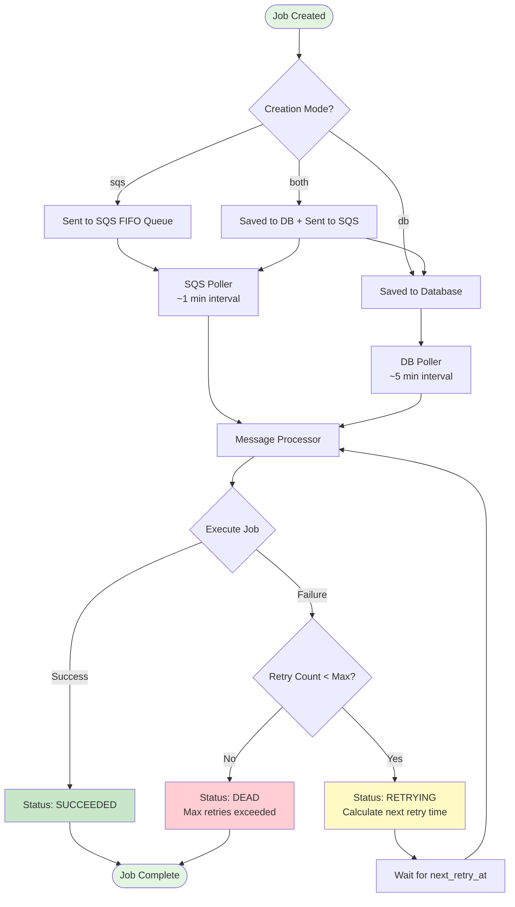
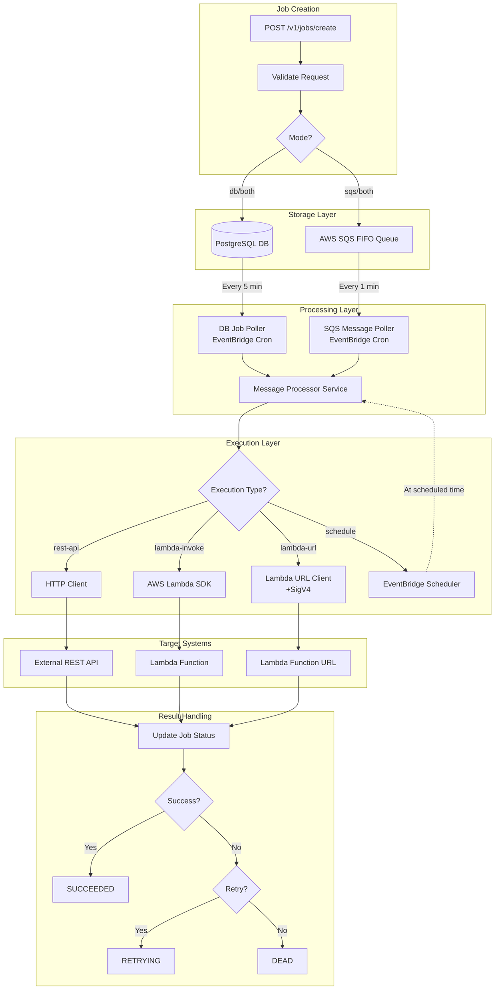
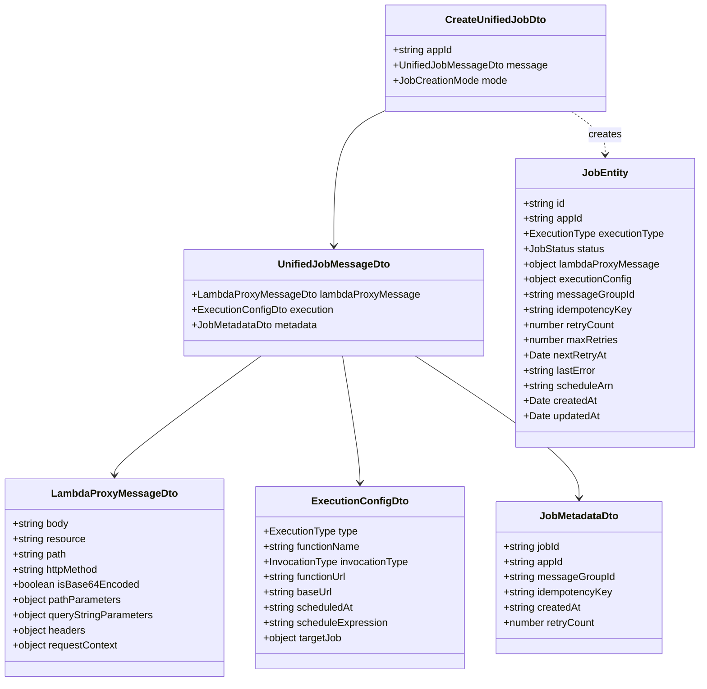

# Job API Integration Guide

> **Complete guide for integrating Create Unified Job API into your service**

**Version**: 1.0  
**Last Updated**: January 2, 2026  
**API Endpoint**: `POST /v1/jobs/create`

---

## Table of Contents

1. [Quick Start Guide](#1-quick-start-guide)
2. [Job Creation Modes](#2-job-creation-modes)
3. [Execution Types](#3-execution-types)
   - [3.1 REST API Execution](#31-rest-api-execution-rest-api)
   - [3.2 Lambda Invoke Execution](#32-lambda-invoke-execution-lambda-invoke)
   - [3.3 Lambda URL Execution](#33-lambda-url-execution-lambda-url)
   - [3.4 Scheduled Job Execution](#34-scheduled-job-execution-schedule)
4. [API Specification](#4-api-specification)
   - [4.1 Request Schema](#41-request-schema)
   - [4.2 Response Schema](#42-response-schema)
   - [4.3 Error Responses](#43-error-responses)
5. [Complete Examples](#5-complete-examples)
   - [5.1 REST API Webhook Example](#51-rest-api-webhook-example)
   - [5.2 Lambda Function Trigger Example](#52-lambda-function-trigger-example)
   - [5.3 Scheduled Job Example](#53-scheduled-job-example)
   - [5.4 Complex Scenario Example](#54-complex-scenario-example)
6. [Job Lifecycle](#6-job-lifecycle)
7. [Best Practices](#7-best-practices)
8. [Integration Checklist](#8-integration-checklist)
9. [Monitoring and Debugging](#9-monitoring-and-debugging)
10. [FAQ](#10-faq)

---

## 1. Quick Start Guide

### Overview

The Unified Job API allows you to create asynchronous jobs that can execute various types of operations:
- Call external/internal REST APIs (webhooks, callbacks)
- Invoke AWS Lambda functions
- Execute scheduled jobs at specific times
- Trigger Lambda Function URLs

### Prerequisites

Before using the Job API, ensure you have:

- **JWT Bearer Token**: For authentication
- **App ID (UUID)**: Your application identifier in the system
- **Base URL**: API base URL (e.g., `https://api.example.com`)

### Authentication

All requests require JWT authentication:

```http
Authorization: Bearer <your-jwt-token>
```

### Minimal Example: REST API Call

Here's the simplest example to call a webhook:

```bash
curl -X POST https://api.example.com/v1/jobs/create \
  -H "Authorization: Bearer YOUR_JWT_TOKEN" \
  -H "Content-Type: application/json" \
  -d '{
    "appId": "550e8400-e29b-41d4-a716-446655440000",
    "mode": "sqs",
    "message": {
      "lambdaProxyMessage": {
        "body": "{\"orderId\":\"123\",\"status\":\"completed\"}",
        "resource": "/{proxy+}",
        "path": "/webhooks/payment",
        "httpMethod": "POST",
        "isBase64Encoded": false,
        "pathParameters": {
          "proxy": "webhooks/payment"
        },
        "headers": {
          "Content-Type": "application/json"
        },
        "requestContext": {
          "path": "/webhooks/payment",
          "resourcePath": "/{proxy+}",
          "httpMethod": "POST"
        }
      },
      "execution": {
        "type": "rest-api",
        "baseUrl": "https://your-service.com"
      },
      "metadata": {
        "messageGroupId": "rest-api",
        "createdAt": "2025-01-01T00:00:00.000Z",
        "idempotencyKey": "payment-webhook-order-123"
      }
    }
  }'
```

**Response** (mode: `sqs`):
```json
null
```

**Response** (mode: `db` or `both`):
```json
{
  "success": true,
  "data": {
    "id": "job-uuid-here",
    "appId": "550e8400-e29b-41d4-a716-446655440000",
    "status": "PENDING",
    "executionType": "rest-api",
    "retryCount": 0,
    "maxRetries": 10,
    "createdAt": "2025-01-01T00:00:00.000Z"
  }
}
```

---

## 2. Job Creation Modes

The Job API supports three creation modes that determine how jobs are stored and processed:

### Mode Comparison Table

| Mode   | DB Storage | SQS Queue | Processing Speed | Use Case |
|--------|-----------|-----------|------------------|----------|
| `sqs`  | ❌ No     | ✅ Yes    | 🟢 Fast (~1 min) | High-throughput, ephemeral jobs |
| `db`   | ✅ Yes    | ❌ No     | 🟡 Slower (~5 min) | Jobs requiring audit trail |
| `both` | ✅ Yes    | ✅ Yes    | 🟢 Fast (~1 min) | Production (recommended) |

### Mode Details

#### `sqs` - SQS Only Mode
- **Processing**: Immediate (SQS polling every ~1 minute)
- **Storage**: Not stored in database
- **Return Value**: `null` (no job entity)
- **Best For**: High-volume, fire-and-forget operations
- **Trade-off**: No persistence, cannot query job status later

```json
{
  "mode": "sqs"
}
```

#### `db` - Database Only Mode
- **Processing**: Delayed (DB polling every ~5 minutes)
- **Storage**: Persisted in PostgreSQL
- **Return Value**: Job entity with ID
- **Best For**: Jobs requiring audit trail, lower priority tasks
- **Trade-off**: Slower processing time

```json
{
  "mode": "db"
}
```

#### `both` - Hybrid Mode (Default, Recommended)
- **Processing**: Fast (SQS) + Reliable (DB)
- **Storage**: Both SQS and Database
- **Return Value**: Job entity with ID
- **Best For**: Production workloads requiring both speed and reliability
- **Trade-off**: Slightly higher resource usage

```json
{
  "mode": "both"
}
```

**💡 Recommendation**: Use `both` mode for production systems to ensure job reliability while maintaining fast processing.

---

## 3. Execution Types

The Job API supports four execution types, each designed for different integration scenarios.

### 3.1 REST API Execution (`rest-api`)

Execute HTTP requests to external or internal REST APIs. Perfect for webhooks and callbacks.

#### Use Cases
- Payment gateway webhooks
- Order fulfillment callbacks
- Email/SMS service notifications
- Third-party service integrations

#### Required Fields

```typescript
{
  "execution": {
    "type": "rest-api",
    "baseUrl": "https://your-service.com"  // Base URL for REST API
  },
  "lambdaProxyMessage": {
    "path": "/webhooks/payment",           // Endpoint path
    "httpMethod": "POST",                  // HTTP method
    "body": "{...}",                       // Request body as JSON string
    "headers": {                           // Custom headers
      "Content-Type": "application/json"
    }
  }
}
```

#### Complete Example

```json
{
  "appId": "550e8400-e29b-41d4-a716-446655440000",
  "mode": "both",
  "message": {
    "lambdaProxyMessage": {
      "body": "{\"orderId\":\"12345\",\"amount\":5000,\"status\":\"paid\"}",
      "resource": "/{proxy+}",
      "path": "/api/webhooks/payment-completed",
      "httpMethod": "POST",
      "isBase64Encoded": false,
      "pathParameters": {
        "proxy": "api/webhooks/payment-completed"
      },
      "headers": {
        "Content-Type": "application/json",
        "X-Custom-Header": "my-value"
      },
      "requestContext": {
        "path": "/api/webhooks/payment-completed",
        "resourcePath": "/{proxy+}",
        "httpMethod": "POST"
      }
    },
    "execution": {
      "type": "rest-api",
      "baseUrl": "https://partner-service.com"
    },
    "metadata": {
      "messageGroupId": "rest-api",
      "idempotencyKey": "payment-webhook-12345",
      "createdAt": "2025-01-01T12:00:00.000Z"
    }
  }
}
```

#### What Happens
1. Job is created and stored (if `db` or `both` mode)
2. Message is sent to SQS (if `sqs` or `both` mode)
3. Message processor picks up the job
4. HTTP request is made: `POST https://partner-service.com/api/webhooks/payment-completed`
5. Response is validated against expected status codes
6. Job status updated to `SUCCEEDED` or `FAILED`

---

### 3.2 Lambda Invoke Execution (`lambda-invoke`)

Directly invoke AWS Lambda functions using the AWS SDK. Supports asynchronous (Event) invocation.

#### Use Cases
- Trigger internal Lambda functions
- Serverless workflow orchestration
- Background processing tasks
- Event-driven architectures

#### Required Fields

```typescript
{
  "execution": {
    "type": "lambda-invoke",
    "functionName": "my-lambda-function",     // Lambda function name or ARN
    "invocationType": "Event"                 // "Event" (async) or "RequestResponse" (sync)
  },
  "lambdaProxyMessage": {
    "body": "{...}",                          // Payload for Lambda
    "httpMethod": "POST",
    "path": "/invoke"
  }
}
```

#### Complete Example

```json
{
  "appId": "550e8400-e29b-41d4-a716-446655440000",
  "mode": "both",
  "message": {
    "lambdaProxyMessage": {
      "body": "{\"userId\":\"user-123\",\"action\":\"process-reward\",\"points\":100}",
      "resource": "/{proxy+}",
      "path": "/invoke",
      "httpMethod": "POST",
      "isBase64Encoded": false,
      "pathParameters": {
        "proxy": "invoke"
      },
      "headers": {
        "Content-Type": "application/json"
      },
      "requestContext": {
        "path": "/invoke",
        "resourcePath": "/{proxy+}",
        "httpMethod": "POST"
      }
    },
    "execution": {
      "type": "lambda-invoke",
      "functionName": "reward-processor-function",
      "invocationType": "Event"
    },
    "metadata": {
      "messageGroupId": "lambda-invoke",
      "idempotencyKey": "reward-process-user-123",
      "createdAt": "2025-01-01T12:00:00.000Z"
    }
  }
}
```

#### What Happens
1. Job is created and queued
2. Message processor invokes Lambda using AWS SDK
3. Lambda function receives the full `lambdaProxyMessage` as event
4. Invocation mode:
   - `Event`: Asynchronous (fire-and-forget)
   - `RequestResponse`: Synchronous (waits for response)
5. Job status updated based on invocation result

---

### 3.3 Lambda URL Execution (`lambda-url`)

Call AWS Lambda Function URLs with automatic SigV4 authentication.

#### Use Cases
- Invoke Lambda via HTTPS endpoint
- Secure Lambda communication with SigV4
- Serverless HTTP API calls
- AWS service-to-service communication

#### Required Fields

```typescript
{
  "execution": {
    "type": "lambda-url",
    "functionUrl": "https://abc123xyz.lambda-url.us-east-1.on.aws/"
  },
  "lambdaProxyMessage": {
    "path": "/process",
    "httpMethod": "POST",
    "body": "{...}"
  }
}
```

#### Complete Example

```json
{
  "appId": "550e8400-e29b-41d4-a716-446655440000",
  "mode": "both",
  "message": {
    "lambdaProxyMessage": {
      "body": "{\"eventType\":\"order-created\",\"orderId\":\"order-789\"}",
      "resource": "/{proxy+}",
      "path": "/events/order",
      "httpMethod": "POST",
      "isBase64Encoded": false,
      "pathParameters": {
        "proxy": "events/order"
      },
      "headers": {
        "Content-Type": "application/json"
      },
      "requestContext": {
        "path": "/events/order",
        "resourcePath": "/{proxy+}",
        "httpMethod": "POST"
      }
    },
    "execution": {
      "type": "lambda-url",
      "functionUrl": "https://xyz789abc.lambda-url.ap-northeast-2.on.aws/"
    },
    "metadata": {
      "messageGroupId": "lambda-url",
      "idempotencyKey": "order-event-789",
      "createdAt": "2025-01-01T12:00:00.000Z"
    }
  }
}
```

#### What Happens
1. Job is created and queued
2. Message processor prepares HTTP request to Lambda URL
3. Request is signed with AWS SigV4 authentication
4. HTTP POST request sent to Function URL
5. Response validated and job status updated

---

### 3.4 Scheduled Job Execution (`schedule`)

Create jobs that execute at a specific future time using AWS EventBridge Scheduler.

#### Use Cases
- Delayed job execution (e.g., retry after 1 hour)
- Scheduled notifications (e.g., reminder emails)
- Time-based workflows (e.g., subscription renewals)
- Deferred operations (e.g., trial expiration)

#### Required Fields

```typescript
{
  "execution": {
    "type": "schedule",
    "scheduledAt": "2025-01-15T10:00:00.000Z",  // ISO 8601 timestamp
    "scheduleExpression": "at(2025-01-15T10:00:00)",  // EventBridge expression
    "targetJob": {                               // The job to execute when triggered
      "lambdaProxyMessage": { /* ... */ },
      "execution": { "type": "rest-api", /* ... */ },
      "metadata": { /* ... */ }
    }
  }
}
```

#### Complete Example: Scheduled Webhook

```json
{
  "appId": "550e8400-e29b-41d4-a716-446655440000",
  "mode": "both",
  "message": {
    "lambdaProxyMessage": {
      "body": "{}",
      "resource": "/{proxy+}",
      "path": "/schedule",
      "httpMethod": "POST",
      "isBase64Encoded": false,
      "pathParameters": {
        "proxy": "schedule"
      },
      "headers": {
        "Content-Type": "application/json"
      },
      "requestContext": {
        "path": "/schedule",
        "resourcePath": "/{proxy+}",
        "httpMethod": "POST"
      }
    },
    "execution": {
      "type": "schedule",
      "scheduledAt": "2025-01-15T10:00:00.000Z",
      "scheduleExpression": "at(2025-01-15T10:00:00)",
      "targetJob": {
        "lambdaProxyMessage": {
          "body": "{\"subscriptionId\":\"sub-456\",\"action\":\"trial-expiry-reminder\"}",
          "resource": "/{proxy+}",
          "path": "/api/notifications/trial-expiry",
          "httpMethod": "POST",
          "isBase64Encoded": false,
          "pathParameters": {
            "proxy": "api/notifications/trial-expiry"
          },
          "headers": {
            "Content-Type": "application/json"
          },
          "requestContext": {
            "path": "/api/notifications/trial-expiry",
            "resourcePath": "/{proxy+}",
            "httpMethod": "POST"
          }
        },
        "execution": {
          "type": "rest-api",
          "baseUrl": "https://notification-service.com"
        },
        "metadata": {
          "messageGroupId": "rest-api",
          "idempotencyKey": "trial-reminder-sub-456",
          "createdAt": "2025-01-15T10:00:00.000Z"
        }
      }
    },
    "metadata": {
      "messageGroupId": "schedule",
      "idempotencyKey": "schedule-trial-reminder-sub-456",
      "createdAt": "2025-01-01T12:00:00.000Z"
    }
  }
}
```

#### What Happens
1. Schedule job is created with `PENDING` status
2. EventBridge Scheduler is created with target time
3. Schedule ARN is stored in job entity
4. At scheduled time, EventBridge triggers the processor
5. The `targetJob` is extracted and executed
6. Original schedule job is marked as `SUCCEEDED`
7. Target job is processed according to its execution type

**⚠️ Note**: The `schedule` execution type is a **wrapper** that schedules another job. The actual work is defined in `targetJob`.

---

## 4. API Specification

### 4.1 Request Schema

#### `CreateUnifiedJobDto`

Root request body structure.

| Field | Type | Required | Description |
|-------|------|----------|-------------|
| `appId` | string (UUID) | No | Application ID for multi-tenancy (defaults to system default) |
| `message` | UnifiedJobMessageDto | Yes | Complete job message structure |
| `mode` | JobCreationMode | No | Creation mode: `sqs`, `db`, or `both` (default: `sqs`) |

#### `UnifiedJobMessageDto`

Complete job message containing execution details.

| Field | Type | Required | Description |
|-------|------|----------|-------------|
| `lambdaProxyMessage` | LambdaProxyMessageDto | Yes | AWS Lambda proxy event structure |
| `execution` | ExecutionConfigDto | Yes | Execution type and configuration |
| `metadata` | JobMetadataDto | Yes | Job tracking metadata |

#### `LambdaProxyMessageDto`

AWS Lambda proxy event structure (used by all execution types).

| Field | Type | Required | Description |
|-------|------|----------|-------------|
| `body` | string \| null | Yes | Request body as JSON string (null for GET requests) |
| `resource` | string | Yes | API Gateway resource pattern (usually `/{proxy+}`) |
| `path` | string | Yes | Request path (e.g., `/api/webhooks/payment`) |
| `httpMethod` | string | Yes | HTTP method: `GET`, `POST`, `PUT`, `DELETE` |
| `isBase64Encoded` | boolean | Yes | Whether body is base64 encoded (usually `false`) |
| `pathParameters` | object | Yes | Path parameters (e.g., `{ "proxy": "api/webhooks/payment" }`) |
| `queryStringParameters` | object | No | Query string parameters |
| `headers` | object | Yes | HTTP headers (e.g., `{ "Content-Type": "application/json" }`) |
| `requestContext` | object | Yes | Request context with `path`, `resourcePath`, `httpMethod` |

#### `ExecutionConfigDto`

Type-specific execution configuration.

| Field | Type | Required | Applies To | Description |
|-------|------|----------|------------|-------------|
| `type` | ExecutionType | Yes | All | Execution type: `rest-api`, `lambda-invoke`, `lambda-url`, `schedule` |
| `baseUrl` | string | Conditional | `rest-api` | Base URL for REST API (e.g., `https://api.example.com`) |
| `functionName` | string | Conditional | `lambda-invoke` | Lambda function name or ARN |
| `invocationType` | InvocationType | No | `lambda-invoke` | `Event` (async) or `RequestResponse` (sync), default: `Event` |
| `functionUrl` | string | Conditional | `lambda-url` | Lambda Function URL (e.g., `https://xyz.lambda-url.us-east-1.on.aws/`) |
| `scheduledAt` | string (ISO 8601) | Conditional | `schedule` | Scheduled execution time |
| `scheduleExpression` | string | Conditional | `schedule` | EventBridge schedule expression (e.g., `at(2025-01-15T10:00:00)`) |
| `targetJob` | object | Conditional | `schedule` | Target job to execute when schedule triggers |

#### `JobMetadataDto`

Job tracking and audit metadata.

| Field | Type | Required | Description |
|-------|------|----------|-------------|
| `jobId` | string (UUID) | No | Auto-generated job ID (set by system) |
| `appId` | string (UUID) | No | App ID (inherited from parent or set by system) |
| `messageGroupId` | string | Yes | SQS FIFO message group ID (usually same as execution type) |
| `idempotencyKey` | string | No | Unique key for duplicate prevention (highly recommended) |
| `createdAt` | string (ISO 8601) | Yes | Job creation timestamp |
| `retryCount` | number | No | Current retry attempt count (default: 0) |

#### `JobCreationMode` Enum

```typescript
enum JobCreationMode {
  DB = "db",      // Database only
  SQS = "sqs",    // SQS only
  BOTH = "both"   // Both DB and SQS (default)
}
```

#### `ExecutionType` Enum

```typescript
enum ExecutionType {
  REST_API = "rest-api",           // REST API call
  LAMBDA_INVOKE = "lambda-invoke", // Lambda SDK invoke
  LAMBDA_URL = "lambda-url",       // Lambda Function URL
  SCHEDULE = "schedule"            // EventBridge scheduled execution
}
```

---

### 4.2 Response Schema

#### Success Response (mode: `db` or `both`)

When jobs are stored in the database, a `JobEntity` is returned:

```json
{
  "success": true,
  "data": {
    "id": "550e8400-e29b-41d4-a716-446655440000",
    "appId": "app-uuid-here",
    "executionType": "rest-api",
    "status": "PENDING",
    "lambdaProxyMessage": { /* full message */ },
    "executionConfig": { /* execution config */ },
    "messageGroupId": "rest-api",
    "idempotencyKey": "payment-webhook-123",
    "retryCount": 0,
    "maxRetries": 10,
    "nextRetryAt": "2025-01-01T12:00:00.000Z",
    "lastError": null,
    "scheduleArn": null,
    "createdAt": "2025-01-01T12:00:00.000Z",
    "updatedAt": "2025-01-01T12:00:00.000Z"
  },
  "timestamp": "2025-01-01T12:00:00.000Z"
}
```

#### Success Response (mode: `sqs`)

When using SQS-only mode, `null` is returned:

```json
null
```

**Note**: In `sqs` mode, the job is immediately queued and not stored in the database, so there's no entity to return.

#### Job Status Enum

```typescript
enum JobStatus {
  PENDING = "PENDING",       // Created, waiting for execution
  RETRYING = "RETRYING",     // Failed, will retry
  SUCCEEDED = "SUCCEEDED",   // Completed successfully
  FAILED = "FAILED",         // Failed but retries remaining
  DEAD = "DEAD"              // Permanently failed (max retries exceeded)
}
```

---

### 4.3 Error Responses

#### 400 Bad Request

Invalid request body or validation error.

```json
{
  "success": false,
  "error": {
    "code": "BAD_REQUEST",
    "message": "Validation failed",
    "details": [
      {
        "field": "message.execution.type",
        "message": "execution.type must be a valid enum value"
      }
    ]
  },
  "timestamp": "2025-01-01T12:00:00.000Z"
}
```

#### 401 Unauthorized

Missing or invalid JWT token.

```json
{
  "success": false,
  "error": {
    "code": "UNAUTHORIZED",
    "message": "Invalid or missing authentication token"
  },
  "timestamp": "2025-01-01T12:00:00.000Z"
}
```

#### 403 Forbidden

Insufficient permissions (requires `APP_ADMIN` role).

```json
{
  "success": false,
  "error": {
    "code": "FORBIDDEN",
    "message": "Access denied: APP_ADMIN role required"
  },
  "timestamp": "2025-01-01T12:00:00.000Z"
}
```

#### 500 Internal Server Error

Unexpected server error.

```json
{
  "success": false,
  "error": {
    "code": "INTERNAL_SERVER_ERROR",
    "message": "An unexpected error occurred"
  },
  "timestamp": "2025-01-01T12:00:00.000Z"
}
```

---

## 5. Complete Examples

### 5.1 REST API Webhook Example

**Scenario**: Send payment confirmation webhook to partner service

#### cURL

```bash
curl -X POST https://api.example.com/v1/jobs/create \
  -H "Authorization: Bearer YOUR_JWT_TOKEN" \
  -H "Content-Type: application/json" \
  -d '{
    "appId": "550e8400-e29b-41d4-a716-446655440000",
    "mode": "both",
    "message": {
      "lambdaProxyMessage": {
        "body": "{\"orderId\":\"ORD-12345\",\"amount\":15000,\"currency\":\"KRW\",\"status\":\"paid\",\"paidAt\":\"2025-01-01T12:00:00Z\"}",
        "resource": "/{proxy+}",
        "path": "/api/v1/webhooks/payment-completed",
        "httpMethod": "POST",
        "isBase64Encoded": false,
        "pathParameters": {
          "proxy": "api/v1/webhooks/payment-completed"
        },
        "headers": {
          "Content-Type": "application/json",
          "X-Webhook-Source": "job-api"
        },
        "requestContext": {
          "path": "/api/v1/webhooks/payment-completed",
          "resourcePath": "/{proxy+}",
          "httpMethod": "POST"
        }
      },
      "execution": {
        "type": "rest-api",
        "baseUrl": "https://partner-api.com"
      },
      "metadata": {
        "messageGroupId": "rest-api",
        "idempotencyKey": "payment-webhook-ORD-12345",
        "createdAt": "2025-01-01T12:00:00.000Z"
      }
    }
  }'
```

#### JavaScript (Node.js with Axios)

```javascript
const axios = require('axios');

async function createPaymentWebhook(orderId, amount, currency) {
  const payload = {
    appId: '550e8400-e29b-41d4-a716-446655440000',
    mode: 'both',
    message: {
      lambdaProxyMessage: {
        body: JSON.stringify({
          orderId,
          amount,
          currency,
          status: 'paid',
          paidAt: new Date().toISOString()
        }),
        resource: '/{proxy+}',
        path: '/api/v1/webhooks/payment-completed',
        httpMethod: 'POST',
        isBase64Encoded: false,
        pathParameters: {
          proxy: 'api/v1/webhooks/payment-completed'
        },
        headers: {
          'Content-Type': 'application/json',
          'X-Webhook-Source': 'job-api'
        },
        requestContext: {
          path: '/api/v1/webhooks/payment-completed',
          resourcePath: '/{proxy+}',
          httpMethod: 'POST'
        }
      },
      execution: {
        type: 'rest-api',
        baseUrl: 'https://partner-api.com'
      },
      metadata: {
        messageGroupId: 'rest-api',
        idempotencyKey: `payment-webhook-${orderId}`,
        createdAt: new Date().toISOString()
      }
    }
  };

  try {
    const response = await axios.post(
      'https://api.example.com/v1/jobs/create',
      payload,
      {
        headers: {
          'Authorization': `Bearer ${process.env.JWT_TOKEN}`,
          'Content-Type': 'application/json'
        }
      }
    );
    
    console.log('Job created:', response.data);
    return response.data;
  } catch (error) {
    console.error('Failed to create job:', error.response?.data || error.message);
    throw error;
  }
}

// Usage
createPaymentWebhook('ORD-12345', 15000, 'KRW');
```

#### Python (with requests)

```python
import requests
import json
from datetime import datetime
import os

def create_payment_webhook(order_id: str, amount: int, currency: str):
    """Create a payment webhook job"""
    
    payload = {
        "appId": "550e8400-e29b-41d4-a716-446655440000",
        "mode": "both",
        "message": {
            "lambdaProxyMessage": {
                "body": json.dumps({
                    "orderId": order_id,
                    "amount": amount,
                    "currency": currency,
                    "status": "paid",
                    "paidAt": datetime.utcnow().isoformat() + "Z"
                }),
                "resource": "/{proxy+}",
                "path": "/api/v1/webhooks/payment-completed",
                "httpMethod": "POST",
                "isBase64Encoded": False,
                "pathParameters": {
                    "proxy": "api/v1/webhooks/payment-completed"
                },
                "headers": {
                    "Content-Type": "application/json",
                    "X-Webhook-Source": "job-api"
                },
                "requestContext": {
                    "path": "/api/v1/webhooks/payment-completed",
                    "resourcePath": "/{proxy+}",
                    "httpMethod": "POST"
                }
            },
            "execution": {
                "type": "rest-api",
                "baseUrl": "https://partner-api.com"
            },
            "metadata": {
                "messageGroupId": "rest-api",
                "idempotencyKey": f"payment-webhook-{order_id}",
                "createdAt": datetime.utcnow().isoformat() + "Z"
            }
        }
    }
    
    headers = {
        "Authorization": f"Bearer {os.environ['JWT_TOKEN']}",
        "Content-Type": "application/json"
    }
    
    try:
        response = requests.post(
            "https://api.example.com/v1/jobs/create",
            json=payload,
            headers=headers
        )
        response.raise_for_status()
        print("Job created:", response.json())
        return response.json()
    except requests.exceptions.RequestException as e:
        print(f"Failed to create job: {e}")
        raise

# Usage
if __name__ == "__main__":
    create_payment_webhook("ORD-12345", 15000, "KRW")
```

---

### 5.2 Lambda Function Trigger Example

**Scenario**: Trigger reward processing Lambda function

#### cURL

```bash
curl -X POST https://api.example.com/v1/jobs/create \
  -H "Authorization: Bearer YOUR_JWT_TOKEN" \
  -H "Content-Type: application/json" \
  -d '{
    "appId": "550e8400-e29b-41d4-a716-446655440000",
    "mode": "both",
    "message": {
      "lambdaProxyMessage": {
        "body": "{\"userId\":\"user-abc-123\",\"rewardType\":\"signup_bonus\",\"points\":1000}",
        "resource": "/{proxy+}",
        "path": "/process-reward",
        "httpMethod": "POST",
        "isBase64Encoded": false,
        "pathParameters": {
          "proxy": "process-reward"
        },
        "headers": {
          "Content-Type": "application/json"
        },
        "requestContext": {
          "path": "/process-reward",
          "resourcePath": "/{proxy+}",
          "httpMethod": "POST"
        }
      },
      "execution": {
        "type": "lambda-invoke",
        "functionName": "reward-processor-prod",
        "invocationType": "Event"
      },
      "metadata": {
        "messageGroupId": "lambda-invoke",
        "idempotencyKey": "reward-signup-user-abc-123",
        "createdAt": "2025-01-01T12:00:00.000Z"
      }
    }
  }'
```

#### TypeScript (with Fetch API)

```typescript
interface RewardJobParams {
  userId: string;
  rewardType: string;
  points: number;
}

async function triggerRewardProcessing(params: RewardJobParams): Promise<any> {
  const { userId, rewardType, points } = params;
  
  const payload = {
    appId: '550e8400-e29b-41d4-a716-446655440000',
    mode: 'both',
    message: {
      lambdaProxyMessage: {
        body: JSON.stringify({
          userId,
          rewardType,
          points
        }),
        resource: '/{proxy+}',
        path: '/process-reward',
        httpMethod: 'POST',
        isBase64Encoded: false,
        pathParameters: {
          proxy: 'process-reward'
        },
        headers: {
          'Content-Type': 'application/json'
        },
        requestContext: {
          path: '/process-reward',
          resourcePath: '/{proxy+}',
          httpMethod: 'POST'
        }
      },
      execution: {
        type: 'lambda-invoke',
        functionName: 'reward-processor-prod',
        invocationType: 'Event'
      },
      metadata: {
        messageGroupId: 'lambda-invoke',
        idempotencyKey: `reward-${rewardType}-${userId}`,
        createdAt: new Date().toISOString()
      }
    }
  };

  const response = await fetch('https://api.example.com/v1/jobs/create', {
    method: 'POST',
    headers: {
      'Authorization': `Bearer ${process.env.JWT_TOKEN}`,
      'Content-Type': 'application/json'
    },
    body: JSON.stringify(payload)
  });

  if (!response.ok) {
    const error = await response.json();
    throw new Error(`Job creation failed: ${JSON.stringify(error)}`);
  }

  return response.json();
}

// Usage
triggerRewardProcessing({
  userId: 'user-abc-123',
  rewardType: 'signup_bonus',
  points: 1000
});
```

---

### 5.3 Scheduled Job Example

**Scenario**: Schedule a trial expiry notification 7 days in the future

#### cURL

```bash
curl -X POST https://api.example.com/v1/jobs/create \
  -H "Authorization: Bearer YOUR_JWT_TOKEN" \
  -H "Content-Type: application/json" \
  -d '{
    "appId": "550e8400-e29b-41d4-a716-446655440000",
    "mode": "both",
    "message": {
      "lambdaProxyMessage": {
        "body": "{}",
        "resource": "/{proxy+}",
        "path": "/schedule",
        "httpMethod": "POST",
        "isBase64Encoded": false,
        "pathParameters": {
          "proxy": "schedule"
        },
        "headers": {
          "Content-Type": "application/json"
        },
        "requestContext": {
          "path": "/schedule",
          "resourcePath": "/{proxy+}",
          "httpMethod": "POST"
        }
      },
      "execution": {
        "type": "schedule",
        "scheduledAt": "2025-01-08T10:00:00.000Z",
        "scheduleExpression": "at(2025-01-08T10:00:00)",
        "targetJob": {
          "lambdaProxyMessage": {
            "body": "{\"userId\":\"user-456\",\"subscriptionId\":\"sub-789\",\"notificationType\":\"trial_expiry\"}",
            "resource": "/{proxy+}",
            "path": "/api/notifications/send",
            "httpMethod": "POST",
            "isBase64Encoded": false,
            "pathParameters": {
              "proxy": "api/notifications/send"
            },
            "headers": {
              "Content-Type": "application/json"
            },
            "requestContext": {
              "path": "/api/notifications/send",
              "resourcePath": "/{proxy+}",
              "httpMethod": "POST"
            }
          },
          "execution": {
            "type": "rest-api",
            "baseUrl": "https://notification-service.com"
          },
          "metadata": {
            "messageGroupId": "rest-api",
            "idempotencyKey": "trial-expiry-notification-sub-789",
            "createdAt": "2025-01-08T10:00:00.000Z"
          }
        }
      },
      "metadata": {
        "messageGroupId": "schedule",
        "idempotencyKey": "schedule-trial-expiry-sub-789",
        "createdAt": "2025-01-01T12:00:00.000Z"
      }
    }
  }'
```

#### JavaScript Helper Function

```javascript
const { addDays } = require('date-fns'); // npm install date-fns

/**
 * Create a scheduled REST API job
 */
async function scheduleRestApiJob(
  scheduledAt, 
  targetUrl, 
  targetPath, 
  targetBody, 
  idempotencyKey
) {
  const scheduledDate = new Date(scheduledAt);
  const scheduleExpression = `at(${scheduledDate.toISOString().slice(0, 19)})`;
  
  const payload = {
    appId: '550e8400-e29b-41d4-a716-446655440000',
    mode: 'both',
    message: {
      lambdaProxyMessage: {
        body: '{}',
        resource: '/{proxy+}',
        path: '/schedule',
        httpMethod: 'POST',
        isBase64Encoded: false,
        pathParameters: { proxy: 'schedule' },
        headers: { 'Content-Type': 'application/json' },
        requestContext: {
          path: '/schedule',
          resourcePath: '/{proxy+}',
          httpMethod: 'POST'
        }
      },
      execution: {
        type: 'schedule',
        scheduledAt: scheduledDate.toISOString(),
        scheduleExpression,
        targetJob: {
          lambdaProxyMessage: {
            body: JSON.stringify(targetBody),
            resource: '/{proxy+}',
            path: targetPath,
            httpMethod: 'POST',
            isBase64Encoded: false,
            pathParameters: {
              proxy: targetPath.replace(/^\//, '')
            },
            headers: { 'Content-Type': 'application/json' },
            requestContext: {
              path: targetPath,
              resourcePath: '/{proxy+}',
              httpMethod: 'POST'
            }
          },
          execution: {
            type: 'rest-api',
            baseUrl: targetUrl
          },
          metadata: {
            messageGroupId: 'rest-api',
            idempotencyKey: `target-${idempotencyKey}`,
            createdAt: scheduledDate.toISOString()
          }
        }
      },
      metadata: {
        messageGroupId: 'schedule',
        idempotencyKey: `schedule-${idempotencyKey}`,
        createdAt: new Date().toISOString()
      }
    }
  };

  const response = await fetch('https://api.example.com/v1/jobs/create', {
    method: 'POST',
    headers: {
      'Authorization': `Bearer ${process.env.JWT_TOKEN}`,
      'Content-Type': 'application/json'
    },
    body: JSON.stringify(payload)
  });

  return response.json();
}

// Usage: Schedule notification 7 days from now
const futureDate = addDays(new Date(), 7);
scheduleRestApiJob(
  futureDate,
  'https://notification-service.com',
  '/api/notifications/send',
  { userId: 'user-456', type: 'trial_expiry' },
  'trial-expiry-user-456'
);
```

---

### 5.4 Complex Scenario Example

**Scenario**: Payment completion workflow
1. Charge payment
2. Send webhook to fulfillment service
3. Schedule follow-up email 1 day later

#### Complete Workflow Implementation

```typescript
import axios from 'axios';
import { addDays } from 'date-fns';

const API_BASE_URL = 'https://api.example.com';
const JWT_TOKEN = process.env.JWT_TOKEN;
const APP_ID = '550e8400-e29b-41d4-a716-446655440000';

interface OrderDetails {
  orderId: string;
  userId: string;
  amount: number;
  currency: string;
  userEmail: string;
}

/**
 * Complete payment processing workflow
 */
async function processPaymentWorkflow(order: OrderDetails) {
  try {
    // Step 1: Payment already charged (assumed)
    console.log(`Processing order ${order.orderId}...`);
    
    // Step 2: Send immediate webhook to fulfillment service
    const fulfillmentJob = await createFulfillmentWebhook(order);
    console.log('Fulfillment webhook created:', fulfillmentJob.data.id);
    
    // Step 3: Schedule follow-up email 1 day later
    const followUpDate = addDays(new Date(), 1);
    const emailJob = await scheduleFollowUpEmail(order, followUpDate);
    console.log('Follow-up email scheduled:', emailJob.data.id);
    
    return {
      success: true,
      fulfillmentJobId: fulfillmentJob.data.id,
      emailJobId: emailJob.data.id
    };
  } catch (error) {
    console.error('Workflow failed:', error);
    throw error;
  }
}

/**
 * Create fulfillment webhook job (immediate)
 */
async function createFulfillmentWebhook(order: OrderDetails) {
  const payload = {
    appId: APP_ID,
    mode: 'both',
    message: {
      lambdaProxyMessage: {
        body: JSON.stringify({
          orderId: order.orderId,
          userId: order.userId,
          amount: order.amount,
          currency: order.currency,
          status: 'paid',
          timestamp: new Date().toISOString()
        }),
        resource: '/{proxy+}',
        path: '/api/fulfillment/orders',
        httpMethod: 'POST',
        isBase64Encoded: false,
        pathParameters: {
          proxy: 'api/fulfillment/orders'
        },
        headers: {
          'Content-Type': 'application/json',
          'X-Webhook-Event': 'order.paid'
        },
        requestContext: {
          path: '/api/fulfillment/orders',
          resourcePath: '/{proxy+}',
          httpMethod: 'POST'
        }
      },
      execution: {
        type: 'rest-api',
        baseUrl: 'https://fulfillment-service.com'
      },
      metadata: {
        messageGroupId: 'rest-api',
        idempotencyKey: `fulfillment-webhook-${order.orderId}`,
        createdAt: new Date().toISOString()
      }
    }
  };

  return axios.post(`${API_BASE_URL}/v1/jobs/create`, payload, {
    headers: {
      'Authorization': `Bearer ${JWT_TOKEN}`,
      'Content-Type': 'application/json'
    }
  });
}

/**
 * Schedule follow-up email (1 day later)
 */
async function scheduleFollowUpEmail(order: OrderDetails, scheduledDate: Date) {
  const scheduleExpression = `at(${scheduledDate.toISOString().slice(0, 19)})`;
  
  const payload = {
    appId: APP_ID,
    mode: 'both',
    message: {
      lambdaProxyMessage: {
        body: '{}',
        resource: '/{proxy+}',
        path: '/schedule',
        httpMethod: 'POST',
        isBase64Encoded: false,
        pathParameters: { proxy: 'schedule' },
        headers: { 'Content-Type': 'application/json' },
        requestContext: {
          path: '/schedule',
          resourcePath: '/{proxy+}',
          httpMethod: 'POST'
        }
      },
      execution: {
        type: 'schedule',
        scheduledAt: scheduledDate.toISOString(),
        scheduleExpression,
        targetJob: {
          lambdaProxyMessage: {
            body: JSON.stringify({
              to: order.userEmail,
              templateId: 'order-followup',
              variables: {
                orderId: order.orderId,
                userId: order.userId
              }
            }),
            resource: '/{proxy+}',
            path: '/api/emails/send',
            httpMethod: 'POST',
            isBase64Encoded: false,
            pathParameters: {
              proxy: 'api/emails/send'
            },
            headers: {
              'Content-Type': 'application/json'
            },
            requestContext: {
              path: '/api/emails/send',
              resourcePath: '/{proxy+}',
              httpMethod: 'POST'
            }
          },
          execution: {
            type: 'rest-api',
            baseUrl: 'https://email-service.com'
          },
          metadata: {
            messageGroupId: 'rest-api',
            idempotencyKey: `followup-email-${order.orderId}`,
            createdAt: scheduledDate.toISOString()
          }
        }
      },
      metadata: {
        messageGroupId: 'schedule',
        idempotencyKey: `schedule-email-${order.orderId}`,
        createdAt: new Date().toISOString()
      }
    }
  };

  return axios.post(`${API_BASE_URL}/v1/jobs/create`, payload, {
    headers: {
      'Authorization': `Bearer ${JWT_TOKEN}`,
      'Content-Type': 'application/json'
    }
  });
}

// Usage
const sampleOrder: OrderDetails = {
  orderId: 'ORD-99999',
  userId: 'user-abc-123',
  amount: 50000,
  currency: 'KRW',
  userEmail: 'customer@example.com'
};

processPaymentWorkflow(sampleOrder)
  .then(result => console.log('Workflow completed:', result))
  .catch(error => console.error('Workflow error:', error));
```

---

## 6. Job Lifecycle

### Lifecycle State Diagram



### Status Transitions

| Current Status | Next Status | Trigger | Description |
|----------------|-------------|---------|-------------|
| `PENDING` | `SUCCEEDED` | Execution successful | First attempt succeeded |
| `PENDING` | `RETRYING` | Execution failed (retries remaining) | First attempt failed, will retry |
| `PENDING` | `DEAD` | Execution failed (no retries) | First attempt failed, unrecoverable |
| `RETRYING` | `SUCCEEDED` | Execution successful | Retry succeeded |
| `RETRYING` | `RETRYING` | Execution failed (retries remaining) | Retry failed, will retry again |
| `RETRYING` | `DEAD` | Execution failed (max retries) | All retries exhausted |

### Retry Strategy

Jobs automatically retry with exponential backoff:

| Retry # | Delay | Cumulative Time |
|---------|-------|-----------------|
| 1 | 1 min | 1 min |
| 2 | 2 min | 3 min |
| 3 | 4 min | 7 min |
| 4 | 8 min | 15 min |
| 5 | 16 min | 31 min |
| 6 | 32 min | 63 min |
| 7 | 64 min | ~2 hours |
| 8 | 128 min | ~4 hours |
| 9 | 256 min | ~8 hours |
| 10 | 512 min | ~16 hours |

**Default**: `maxRetries = 10`

### Processing Architecture



---

## 7. Best Practices

### 7.1 Use Idempotency Keys

Always provide an `idempotencyKey` to prevent duplicate job creation:

```json
{
  "metadata": {
    "idempotencyKey": "payment-webhook-ORDER-12345"
  }
}
```

**Pattern**: `{operation-type}-{resource-type}-{resource-id}`

Examples:
- `payment-webhook-ORDER-12345`
- `reward-grant-USER-abc-123`
- `email-notification-SUBSCRIPTION-789`

### 7.2 Choose the Right Creation Mode

| Scenario | Recommended Mode | Reason |
|----------|------------------|--------|
| Production payments/orders | `both` | Reliability + Speed |
| High-volume analytics events | `sqs` | Performance, no need for audit |
| Financial transactions | `both` | Audit trail required |
| Testing/development | `db` | Easy to debug and inspect |
| Time-sensitive notifications | `both` or `sqs` | Fast processing |

### 7.3 Structure Lambda Proxy Messages Properly

Even for non-REST API execution types, the Lambda proxy structure is used. Follow these guidelines:

**For REST API**:
```json
{
  "path": "/api/webhooks/payment",  // Actual endpoint path
  "httpMethod": "POST",
  "body": "{...}",                  // Actual request body
  "headers": {
    "Content-Type": "application/json"
  }
}
```

**For Lambda Invoke**:
```json
{
  "path": "/invoke",                // Generic path
  "httpMethod": "POST",
  "body": "{...}",                  // Lambda payload
  "headers": {
    "Content-Type": "application/json"
  }
}
```

### 7.4 Handle Errors Gracefully

Jobs may fail due to:
- Network timeouts
- Target service downtime
- Invalid payloads
- Rate limiting

**Your service should**:
- Accept webhooks/callbacks idempotently
- Return appropriate HTTP status codes (2xx for success)
- Log incoming requests for debugging
- Implement retry tolerance (handle duplicate deliveries)

### 7.5 Set Appropriate Retry Limits

Default is `maxRetries: 10`, but you can customize:

```typescript
// For critical operations (higher retry)
maxRetries: 15  // ~24 hours of retries

// For time-sensitive operations (lower retry)
maxRetries: 5   // ~30 minutes of retries
```

⚠️ **Note**: Currently, `maxRetries` is set at database level. Contact system admin to adjust per job.

### 7.6 Monitor Job Status

For jobs created with `db` or `both` mode, you can query status:

```http
GET /v1/admin/jobs?status=RETRYING&limit=100
Authorization: Bearer YOUR_JWT_TOKEN
```

Track metrics:
- Job success rate
- Average retry count
- Jobs in `DEAD` status (investigate failures)
- Processing latency

### 7.7 Secure Sensitive Data

- **Never** include passwords or API keys in job bodies
- Use AWS Secrets Manager references
- Implement HMAC signatures for webhooks (system handles this)
- Encrypt sensitive payloads if needed

### 7.8 Use Scheduled Jobs Wisely

Scheduled jobs create EventBridge Schedules which incur AWS costs:

- Use for one-time future executions
- Consider alternatives for recurring patterns (use cron jobs instead)
- Clean up by ensuring jobs complete (schedules auto-delete on success)

---

## 8. Integration Checklist

### Pre-Integration Setup

- [ ] **Obtain JWT Token**
  - Contact admin to create service account
  - Generate JWT with `APP_ADMIN` role
  - Store token securely (environment variable)

- [ ] **Get App ID**
  - Verify your application UUID in the system
  - Default app ID: `eb3fcbb2-7bb3-4ac7-aa38-1cb4bf00e405`

- [ ] **Configure Target Endpoints**
  - For REST API: Whitelist callback URLs in app settings
  - For Lambda: Ensure IAM permissions for invocation
  - For Lambda URL: Configure auth mode (AWS_IAM)

### Implementation Checklist

- [ ] **Choose Execution Type**
  - `rest-api` for webhooks/HTTP calls
  - `lambda-invoke` for internal Lambda functions
  - `lambda-url` for Lambda Function URLs
  - `schedule` for delayed/scheduled execution

- [ ] **Implement Job Creation**
  - Install HTTP client (axios, fetch, requests)
  - Create helper function/class for job creation
  - Add error handling and retry logic
  - Implement idempotency key generation

- [ ] **Test Job Creation**
  - Test with `mode: "db"` for easy debugging
  - Verify job appears in database
  - Check job status transitions
  - Validate target endpoint receives payload

- [ ] **Configure Target Endpoint**
  - Implement idempotent request handling
  - Return 2xx status codes for success
  - Log all incoming requests
  - Handle duplicate deliveries gracefully

- [ ] **Production Readiness**
  - Switch to `mode: "both"` for reliability
  - Set up monitoring/alerting
  - Document integration in your service
  - Add integration tests

### Testing Checklist

- [ ] **Happy Path Tests**
  - Job creation succeeds
  - Target endpoint receives correct payload
  - Job status becomes `SUCCEEDED`

- [ ] **Failure Scenarios**
  - Target endpoint returns 5xx → Job retries
  - Target endpoint timeout → Job retries
  - Invalid payload → Job fails with clear error
  - Max retries exceeded → Job status is `DEAD`

- [ ] **Edge Cases**
  - Duplicate idempotency keys → No duplicate jobs
  - Invalid JWT token → 401 Unauthorized
  - Malformed request body → 400 Bad Request
  - Large payloads (>256KB) → Test limits

### Monitoring Setup

- [ ] **Set Up Dashboards**
  - Job creation rate
  - Job success/failure rate
  - Average processing time
  - Jobs in `RETRYING` status count

- [ ] **Configure Alerts**
  - High number of `DEAD` jobs
  - Processing latency exceeds threshold
  - Job creation API errors
  - Target endpoint downtime

### Documentation

- [ ] **Internal Documentation**
  - Document integration in your service README
  - Add code examples for your team
  - Document error handling strategy
  - Create runbook for common issues

---

## 9. Monitoring and Debugging

### Query Job Status (Admin API)

```bash
# List jobs with filters
curl -X GET "https://api.example.com/v1/admin/jobs?status=RETRYING&limit=50" \
  -H "Authorization: Bearer YOUR_JWT_TOKEN"

# Get specific job by ID
curl -X GET "https://api.example.com/v1/admin/jobs/{jobId}" \
  -H "Authorization: Bearer YOUR_JWT_TOKEN"
```

### Common Issues and Solutions

#### Issue: Job stuck in `PENDING` status

**Possible Causes**:
- SQS poller not running (check EventBridge cron)
- DB poller not running (check EventBridge cron)
- Job not in SQS queue (mode was `db` only)

**Solution**:
1. Check EventBridge schedulers are enabled
2. Verify SQS queue has messages
3. Check system logs for errors

#### Issue: Jobs failing with `DEAD` status

**Possible Causes**:
- Target endpoint always returning errors
- Network connectivity issues
- Invalid payload format
- Authentication failures

**Solution**:
1. Check `lastError` field in job entity
2. Verify target endpoint is reachable
3. Test payload format manually
4. Check authentication credentials

#### Issue: Duplicate jobs created

**Possible Causes**:
- Missing or non-unique `idempotencyKey`
- Retrying job creation on client side

**Solution**:
- Always include unique `idempotencyKey`
- Use pattern: `{operation}-{resource-type}-{id}`
- Don't retry job creation on 5xx errors (check if job was created)

### Debugging Lambda Proxy Messages

If your REST API endpoint isn't receiving the expected request:

1. **Check the path construction**:
   - `baseUrl` + `path` = Full URL
   - Example: `https://api.com` + `/webhooks/pay` = `https://api.com/webhooks/pay`

2. **Verify headers**:
   - System adds HMAC signature headers automatically
   - Your custom headers in `headers` field are preserved

3. **Validate body encoding**:
   - `body` must be JSON string, not object
   - Use `JSON.stringify()` for JavaScript
   - Set `isBase64Encoded: false` for JSON

4. **Check requestContext**:
   - Ensure `path`, `resourcePath`, `httpMethod` match your expectations

### Log Analysis

Search for job ID in logs:

```bash
# CloudWatch Logs Insights Query
fields @timestamp, @message
| filter jobId = "550e8400-e29b-41d4-a716-446655440000"
| sort @timestamp desc
| limit 100
```

---

## 10. FAQ

### Q: What's the difference between `mode: "sqs"` and `mode: "both"`?

**A**: `sqs` mode sends jobs only to SQS (fast, no DB storage). `both` mode stores in DB and sends to SQS (reliable, auditable). Use `both` for production.

### Q: Can I customize retry delays?

**A**: No, retry delays follow exponential backoff (2^retry minutes). This is system-level configuration.

### Q: What happens if my target endpoint is down?

**A**: Jobs will retry up to `maxRetries` (default: 10) with exponential backoff. If still failing, status becomes `DEAD`.

### Q: Can I cancel a pending job?

**A**: Jobs in SQS cannot be cancelled. Jobs in DB can be manually deleted by admin (not recommended for audit trail).

### Q: What's the maximum payload size?

**A**: SQS limit is 256KB. For larger payloads, store data externally (S3) and pass reference in job body.

### Q: Can I use GET requests with REST API execution?

**A**: Yes, set `httpMethod: "GET"` and `body: null` or empty string.

### Q: How do I authenticate with my target endpoint?

**A**: Include authentication headers in `lambdaProxyMessage.headers`:

```json
{
  "headers": {
    "Authorization": "Bearer YOUR_TOKEN",
    "X-API-Key": "your-api-key"
  }
}
```

System also adds HMAC signature for verification.

### Q: Can I chain multiple jobs?

**A**: Yes, have your target endpoint create new jobs upon completion. Example:
1. Job A completes → Target endpoint B
2. Endpoint B processes → Creates Job C
3. Job C executes → Final result

### Q: What if scheduled job time is in the past?

**A**: EventBridge will reject the schedule. Ensure `scheduledAt` is in the future.

### Q: Can I query job history?

**A**: Yes, jobs with `mode: "db"` or `both` are stored permanently. Use admin API to query with filters.

### Q: How do I handle timezone issues?

**A**: Always use UTC timestamps in ISO 8601 format (`2025-01-15T10:00:00.000Z`). System processes all times as UTC.

### Q: What's the processing SLA?

**A**:
- SQS mode: ~1 minute (SQS polling interval)
- DB mode: ~5 minutes (DB polling interval)
- Scheduled jobs: Exact time specified (EventBridge accuracy: ±1 minute)

### Q: Can I use this for real-time operations?

**A**: No, this is an asynchronous job system. For real-time, use synchronous API calls directly.

### Q: How do I test without affecting production?

**A**: Use a separate `appId` for testing or set up a staging environment with different base URLs.

---

## Appendix: Data Structure Diagram



---

## Support and Contact

For issues, questions, or feature requests:

- **API Documentation**: Check Swagger UI at `/api-docs`
- **System Status**: Contact platform admin
- **Bug Reports**: Open issue in internal tracking system
- **Feature Requests**: Discuss with architecture team

---

**Document Version**: 1.0  
**Last Updated**: January 2, 2026  
**Maintained By**: Platform Engineering Team

