## 전체 서비스 아키텍처 및 플로우

### 1. 서비스 개요 및 핵심 가치

**미국 주식 O/X 예측 서비스**는 사용자가 매일 선정된 미국 주식 종목에 대해 상승/하락을 예측하고, 정답에 따라 포인트를 획득하여 리워드를 교환할 수 있는 게이미피케이션 서비스입니다.

**핵심 가치제안:**

- **간단한 참여**: 매일 100개 종목에 대한 단순한 O/X 선택
- **공정한 정산**: 예측 시점 스냅샷 가격 대비 EOD(장 마감) 기준 자동 정산
- **보상 시스템**: 예측 성공 시 포인트 지급, 리워드 교환 가능
- **성장 요소**: 광고 시청을 통한 추가 예측 기회 제공

### 2. 전체 시스템 아키텍처

```
┌─────────────────┐    ┌─────────────────┐    ┌─────────────────┐
│   Client Apps   │    │   API Gateway   │    │   FastAPI App   │
│  (Web/Mobile)   │◄──►│                 │◄──►│  (Main Service) │
└─────────────────┘    └─────────────────┘    └─────────────────┘
                                                        │
                       ┌─────────────────┐              │
                       │   OAuth APIs    │◄─────────────┤
                       │ (Google/Kakao)  │              │
                       └─────────────────┘              │
                                                        │
┌─────────────────┐    ┌─────────────────┐              │
│  Batch          │◄──►│   Message Queue │◄─────────────┤
│ (EOD/Settlement)│    │   (AWS SQS)     │              │
└─────────────────┘    └─────────────────┘              │
                                                        │
┌─────────────────┐    ┌─────────────────┐              │
│  External APIs  │◄──►│   PostgreSQL    │◄─────────────┘
│   (Yahoo)       │    │ (crypto schema) │
└─────────────────┘    └─────────────────┘
```

### 3. 데이터 모델 및 핵심 엔티티

**핵심 도메인 객체:**

- **User**: OAuth 기반 사용자 (Google/Kakao 로그인)
- **Session**: 일일 예측 세션 (OPEN/CLOSED 상태)
- **Universe**: 일일 선정 종목 (~100개)
- **Prediction**: 사용자 예측 (상승/하락)
- **Settlement**: 정산 결과 (정답/오답/VOID)
- **Points**: 포인트 원장 (멱등성 보장)
- **Reward**: 리워드 카탈로그 및 교환

**데이터 관계:**

```
User ──┬─► Prediction ──► Settlement ──► Points ──► Reward Redemption
       └─► AdUnlock (광고 시청) ──► Additional Prediction Slots
```

### 4. 상세 사용자 플로우

#### 4.1 사용자 온보딩 및 인증

```mermaid
graph TD
    A[사용자 접속] --> B[OAuth 로그인 선택]
    B --> C[Google/Kakao 인증]
    C --> D[JWT 토큰 발급]
    D --> E[사용자 세션 생성]
    E --> F[신규 가입자 1000포인트 지급]
```



```
  실제 API 엔드포인트:

  | 플로우 단계        | API 엔드포인트                                  | 파일 위치              | 상태    |
  |----------------|-----------------------------------------------|----------------------|-------|
  | OAuth 인증 시작   | GET /auth/oauth/{provider}/authorize         | auth_router.py:30    | ✅ 완벽 |
  | OAuth 콜백 처리   | GET /auth/oauth/{provider}/callback          | auth_router.py:90    | ✅ 완벽 |
  | 프로그램 콜백 API  | POST /auth/oauth/callback                    | auth_router.py:154   | ✅ 완벽 |
  | JWT 토큰 갱신    | POST /auth/token/refresh                     | auth_router.py:191   | ✅ 완벽 |
  | 로그아웃         | POST /auth/logout                            | auth_router.py:224   | ✅ 완벽 |
  | **신규 가입 보너스** | **1000포인트 자동 지급** (OAuth 콜백 내부 처리)     | auth_service.py:141  | ✅ **신규** |
  | **사용자 생성**    | **OAuth 사용자 생성** (멱등성 보장)              | user_repository.py   | ✅ **신규** |
  | **닉네임 중복처리** | **자동 중복 해결** (name_1, name_2...)        | auth_service.py:122  | ✅ **신규** |

#### 4.1.2 사용자 관리 API (User Router)
```

사용자 프로필 관리 및 포인트 연동 API:

| 기능 분류           | API 엔드포인트                          | 파일 위치          | 상태          |
| ------------------- | --------------------------------------- | ------------------ | ------------- |
| **내 프로필 조회**  | GET /users/me                           | user_router.py:22  | ✅ 완벽       |
| **내 프로필 수정**  | PUT /users/me                           | user_router.py:45  | ✅ 완벽       |
| **사용자 조회**     | GET /users/{user_id}                    | user_router.py:81  | ✅ 완벽       |
| **사용자 목록**     | GET /users/                             | user_router.py:118 | ✅ 완벽       |
| **닉네임 검색**     | GET /users/search/nickname?q={nickname} | user_router.py:154 | ✅ 완벽       |
| **계정 비활성화**   | DELETE /users/me                        | user_router.py:269 | ✅ 완벽       |
| **이메일 중복확인** | POST /users/validate/email              | user_router.py:221 | ✅ 완벽       |
| **닉네임 중복확인** | POST /users/validate/nickname           | user_router.py:244 | ✅ 완벽       |
| **사용자 통계**     | GET /users/stats/overview               | user_router.py:194 | ✅ **관리자** |

#### 4.1.3 포인트 연동 API (User + Points)

```
  사용자별 포인트 관리 API:

  | 기능 분류           | API 엔드포인트                               | 파일 위치                | 상태    |
  |------------------|---------------------------------------------|------------------------|-------|
  | **내 포인트 잔액**    | GET /users/me/points/balance               | user_router.py:303     | ✅ 완벽 |
  | **내 포인트 내역**    | GET /users/me/points/ledger                | user_router.py:324     | ✅ 완벽 |
  | **프로필+포인트**     | GET /users/me/profile-with-points          | user_router.py:355     | ✅ 완벽 |
  | **재정 요약**       | GET /users/me/financial-summary            | user_router.py:374     | ✅ 완벽 |
  | **지불 가능 여부**    | GET /users/me/can-afford/{amount}          | user_router.py:393     | ✅ 완벽 |
```

#### 4.2 일일 예측 참여 플로우

```mermaid
graph TD
    A[메인 페이지 접속] --> B[현재 세션 상태 확인]
    B --> C{세션 상태 확인}
    C -->|OPEN| D[오늘의 종목 100개 조회]
    C -->|CLOSED| E[예측 마감 안내]

    D --> G[사용자 예측 슬롯 확인]
    G --> H{슬롯 여부}
    H -->|있음| I[종목 선택 및 예측 제출]
    H -->|없음| J[광고 시청 또는 쿨다운 대기]

    I --> L[예측 저장 및 확인]

    J --> M[광고 시청 완료]
    M --> N[추가 슬롯 1개 획득]
    N --> I
```



```
  실제 API 엔드포인트:

  | 플로우 단계      | API 엔드포인트                           | 파일 위치                   |
  |-------------|-------------------------------------|-------------------------|
  | 세션 상태 확인    | GET /session/today                  | session_router.py:21    |
  | 예측 가능 여부 체크 | GET /session/can-predict            | session_router.py:170   |
  | 가격 정보 포함 조회 | GET /universe/today/with-prices     |                        |
 | 오늘의 종목 조회   | GET /universe/today                 | universe_router.py:20   |
  | 예측 제출       | POST /predictions/{symbol}          | prediction_router.py:29 |
  | 예측 수정       | PUT /predictions/{prediction_id}    | prediction_router.py:66 |
  | 예측 취소       | DELETE /predictions/{prediction_id} | prediction_router.py:96 |
  | 슬롯 정보 조회    | GET /ads/available-slots            | ad_unlock_router.py:183 |
  | 광고 시청 완료    | POST /ads/watch-complete            | ad_unlock_router.py:54  |
  | 쿨다운 슬롯 해제   | POST /ads/unlock-slot               | ad_unlock_router.py:121 |
```

#### 4.2 쿨다운/광고 슬롯 정책 요약 (2025-09-02 반영)

- 용어: `available = 현재 가용 슬롯` (즉시 사용 가능한 슬롯 수)
- 광고 시청: 1회당 `available + 1`, 상한(cap) = `BASE_PREDICTION_SLOTS + MAX_AD_SLOTS` = `3 + 7 = 10`
- 예측 제출: `available - 1`, `predictions_made + 1` (원자적 트랜잭션으로 처리)
- 자동 쿨다운: `available <= 3`이면 발동, 5분마다 +1, 최대 3까지 회복
  - `available >= 3`이면 쿨다운 불가(추가 충전은 광고로만 가능)
- 예측 취소: 가용 +1, 사용량 -1로 즉시 환불 (cap=10 준수, 상태 PENDING, 기본 5분 이내)
- 일일 초기화(연속성, 거래일 기준):
  - user_daily_stats가 없을 때 초기 가용은 `available = BASE + min(MAX_AD_SLOTS, lifetime_ad_bonus)`
  - lifetime_ad_bonus = `sum(ad_unlocks.unlocked_slots where method='AD')`
  - 따라서 오늘 10까지 언락했다면 내일도 10으로 시작
- 날짜 기준: 세션의 `trading_day` 사용 (USMarketHours → SessionRepository 기준)
- 스키마 변경: `user_daily_stats.max_predictions` → `available_predictions` (2025-09-02)
- 트랜잭션 변경: 예측 생성 + 슬롯 소모 원자 처리 (2025-09-02)

구현 위치
- 로직: `myapi/services/cooldown_service.py`, `myapi/repositories/prediction_repository.py`
- 설정: `myapi/config.py` (`BASE_PREDICTION_SLOTS`, `MAX_AD_SLOTS`, `COOLDOWN_MINUTES`, `COOLDOWN_TRIGGER_THRESHOLD`)
 - 컬럼 리네이밍: `user_daily_stats.max_predictions` → `available_predictions` (2025-09-02)
 - 예측 생성 트랜잭션 통합: 슬롯 소모 + 예측 생성 원자 처리 (2025-09-02)

취소 정책
- 취소는 `PENDING` 상태에서만 허용되며, 서비스 정책에 따른 시간 제한 내에서만 가능(기본 5분 제안).

#### 4.3 정산 및 보상 플로우 (업데이트: 예측시점 가격 대비)

```mermaid
graph TD
    A[23:59 KST 예측 마감] --> B[06:00 KST EOD 데이터 수집, EOD DB 저장]
    B --> C[정산 로직 실행]
    C --> D{예측 결과 (예측시점가격 ↔ 장마감)}
    D -->|정답| E[50포인트 지급]
    D -->|오답| F[포인트 없음]

    E --> H[포인트 원장 업데이트]
    F --> H
    G --> H
    H --> I[사용자 알림 발송]
```

#### 4.4 리워드 교환 플로우

```mermaid
graph TD
    A[리워드 카탈로그 조회] --> B[원하는 상품 선택]
    B --> C{포인트 잔액 확인}
    C -->|충분| E[포인트 차감 및 교환 요청]
    E --> F[외부 벤더 발급 요청]
    F --> G{발급 성공}
    G -->|성공| H[교환 완료 알림]
    G -->|실패| I[포인트 환불]
```



| 플로우 단계        | API 엔드포인트                                  | 파일 위치                | 상태        |
| ------------------ | ----------------------------------------------- | ------------------------ | ----------- |
| 자동 정산          | POST /admin/settlement/settle-day/{trading_day} | settlement_router.py:18  | ✅ 업데이트 |
| 정산 요약          | GET /admin/settlement/summary/{trading_day}     | settlement_router.py:48  | ✅ 완벽     |
| 수동 정산          | POST /admin/settlement/manual-settle            | settlement_router.py:78  | ✅ 완벽     |
| **정산 상태 조회** | GET /settlement/status/{trading_day}            | settlement_router.py:120 | ✅ **신규** |
| **정산 재시도**    | POST /admin/settlement/retry/{trading_day}      | settlement_router.py:152 | ✅ **신규** |
| EOD 가격 조회      | GET /prices/eod/{symbol}/{trading_day}          | -                        | ✅ 구현됨   |
| 포인트 잔액        | GET /points/balance                             | point_router.py:57       | ✅ 완벽     |
| 포인트 내역        | GET /points/ledger                              | point_router.py:93       | ✅ 완벽     |
| **포인트 정합성**  | GET /points/admin/integrity/daily/{trading_day} | point_router.py:499      | ✅ **신규** |
| 리워드 카탈로그    | GET /rewards/catalog                            | reward_router.py:34      | ✅ 완벽     |
| 리워드 교환        | POST /rewards/redeem                            | reward_router.py:72      | ✅ 완벽     |
| 교환 내역          | GET /rewards/my-redemptions                     | reward_router.py:97      | ✅ 완벽     |
| **배치 작업 상태** | GET /batch/jobs/status                          | batch_router.py:425      | ✅ **신규** |
| **배치 긴급중단**  | POST /batch/emergency-stop                      | batch_router.py:501      | ✅ **신규** |

### 5. 시스템 배치 및 자동화 플로우

#### 4.3.1 정산 기준 상세 (업데이트)

- 기준 가격: 각 예측이 제출될 때의 "예측 시점 스냅샷 가격"을 저장하고, 정산 시 EOD 종가와 비교합니다.
- 저장 컬럼 (predictions):
  - `prediction_price` (Numeric(10,4), nullable)
  - `prediction_price_at` (timestamptz, nullable)
  - `prediction_price_source` (varchar, nullable; 예: `universe`)
- 비교 로직:
  - movement = UP if `EOD.close > prediction_price`
  - movement = DOWN if `EOD.close < prediction_price`
  - movement = FLAT if `EOD.close == prediction_price` → 정책(ALL_CORRECT/ALL_WRONG/VOID) 적용
- 호환성: 스냅샷이 없는 과거 데이터(`prediction_price IS NULL`)는 기존대로 `previous_close`를 기준으로 비교합니다.

구현 위치
- 스냅샷 저장: `myapi/services/prediction_service.py`
- 정산 비교: `myapi/services/settlement_service.py`
- 스키마/모델: `myapi/models/prediction.py`, `myapi/schemas/prediction.py`

#### 5.0 KST 기준 거래일 정의 (중요)

- 기준 타임존: KST (UTC+9)
- 거래일 산정 로직: `USMarketHours.get_kst_trading_day()` 사용
  - KST 00:00 ~ 05:59:59 구간은 전날 거래일로 귀속
  - 그 외 시간대는 당일 날짜를 거래일로 간주
- 이전 거래일: `USMarketHours.get_prev_trading_day(from_date)` 사용 (주말/미국 공휴일을 건너뛰어 직전 거래일을 반환)

이 규칙에 따라 배치는 항상 다음의 두 값을 사용합니다.
- `today_trading_day`: 현재 KST 시각을 기준으로 한 거래일
- `yesterday_trading_day`: `today_trading_day`의 직전 거래일

#### 5.1 일일 배치 스케줄 (KST 기준) 및 의존 관계

의존 관계(06:00): EOD 수집 → 정산 → 세션 시작 → 유니버스 설정

```
06:00 - 오전 일괄 배치 (Group: daily-morning-batch)
  1) EOD 수집 (대상: yesterday_trading_day)
     - 입력: yesterday_trading_day의 Universe 목록
     - 처리: Yahoo Finance에서 EOD(OHLCV) 수집
     - 출력: EOD 가격 DB 저장 (symbols x 1일)
  2) 정산 (대상: yesterday_trading_day)
     - 입력: EOD 가격, PENDING 예측 레코드
     - 처리: 가격 비교로 CORRECT/INCORRECT/VOID 판정
     - 출력: 예측 상태 업데이트, 포인트 지급/환불
  3) 세션 시작 (대상: today_trading_day)
     - 가드: today_trading_day가 미국 거래일인 경우에만 수행
     - 입력: today_trading_day
     - 출력: Session OPEN (predict_open_at~predict_cutoff_at, KST 기준)
  4) 유니버스 설정 (대상: today_trading_day)
     - 가드: today_trading_day가 미국 거래일인 경우에만 수행
     - 입력: today_trading_day + 기본 티커 목록
     - 처리: ActiveUniverse 업서트(삭제/삽입/seq 업데이트)
     - 출력: ActiveUniverse 테이블에 당일 유니버스 반영

23:59 - 예측 마감 배치 (Group: daily-evening-batch)
  - 입력: today_trading_day의 Session
  - 처리: Session CLOSED (마감)
  - 출력: predict_cutoff_at 이후 예측 불가
```

#### 5.2 SQS 기반 비동기 처리

```
사용자 예측 제출 → SQS Queue
EOD 데이터 수집 → SQS Queue
정산 완료 → SQS Queue
리워드 교환 → SQS Queue
```

### 6. 고급 기능 및 게이미피케이션

#### 6.1 광고 시스템 및 슬롯 관리

```
기본 예측 슬롯: 3개/일
광고 시청시: +1슬롯 (최대 10개/일)
자동 쿨다운: 5분마다 자동 +1슬롯 (슬롯 < 3개일 때)
```

#### 6.1.1 자동 쿨다운 시스템 (신규)

```mermaid
graph TD
    A[예측 제출] --> B{현재 슬롯 < 3?}
    B -->|Yes| C{활성 쿨다운 있나?}
    B -->|No| Z[종료]
    C -->|No| D[쿨다운 타이머 DB 저장]
    C -->|Yes| Z
    D --> E[EventBridge 5분 스케줄 생성]
    E --> F[5분 후 SQS 메시지 전송]
    F --> G[워커가 슬롯 +1 처리]
    G --> H{아직 슬롯 < 3?}
    H -->|Yes| D
    H -->|No| I[쿨다운 종료]
```



**기술 스택:**
- **DB**: `cooldown_timers` 테이블 (상태 관리)
- **스케줄링**: AWS EventBridge one-time rules
- **메시징**: SQS FIFO 큐 (멱등성 보장)
- **트리거**: 예측 제출 후훅, 슬롯 조건 체크

정확한 동작 규칙 (State Machine 요약):
- 시작 조건: 활성 타이머가 없고 현재 슬롯이 3 미만일 때만 시작
- 예측 제출 직후: 3 → 2로 내려간 순간에 즉시 시작 (2 → 1은 재시작 안 함)
- 회복 규칙: 타이머 만료 시 슬롯이 3 미만이면 +1 회복 (최대 3)
- 재시작 규칙: 회복 후 슬롯이 3 미만이면 자동으로 다음 타이머 재시작, 3이면 재시작하지 않음
- 중복 방지: 활성 타이머가 존재하면 추가 시작 금지

예시 시나리오:
- 3 → 2 (쿨다운 타이머 시작)
- 2 → 1 (쿨다운 타이머 새로 시작 안 함; 기존 유지)
- 1 → 2 (쿨다운 성공; 3 미만이므로 타이머 다시 시작)
- 2 → 3 (쿨다운 성공; 3이 되었으므로 타이머 재시작 안 함)

#### 6.2 포인트 경제 시스템

```
신규 가입: +1000 포인트
정답 보상: +50 포인트/건
리워드 교환: -포인트 (상품별 차등)
```

### 7. 기술적 특징 및 안정성

#### 7.1 데이터 정합성 보장

- **멱등성 보장**: 포인트 지급/차감에 ref_id 기반 중복 방지
- **트랜잭션 관리**: ACID 속성 보장으로 데이터 일관성 유지
- **감사 로그**: 모든 포인트 변동 내역 추적
- **정합성 검증**: 일일 포인트 총합 검증 배치

#### 7.2 성능 및 확장성

- **Connection Pooling**: PostgreSQL 연결 최적화
- **레이트 리밋**: 분당/시간당 API 호출 제한
- **인덱스 최적화**: 핵심 쿼리 성능 향상
- **SQS 큐**: 비동기 처리로 응답성 개선

#### 7.3 모니터링 및 운영

- **비즈니스 메트릭**: DAU, 예측 참여율, 승률, 포인트 순환율
- **시스템 메트릭**: API 응답시간, DB 성능, 큐 처리량
- **알림 시스템**: 배치 실패, 데이터 이상, 보안 위협 감지
- **관리자 도구**: 종목 관리, 포인트 조정, 리워드 관리

### 8. 보안 및 컴플라이언스

#### 8.1 인증 및 권한 관리

- **OAuth 2.0**: Google/Kakao 안전한 로그인
- **JWT 토큰**: RS256 알고리즘 기반 무상태 인증
- **관리자 권한**: MFA 적용, 권한별 API 접근 제어

#### 8.2 데이터 보호

- **개인정보 최소화**: 필수 정보만 수집
- **암호화**: 민감 데이터 AES-256 암호화
- **감사 추적**: 모든 관리자 작업 로깅

### 9. 사용자 측면 상세 플로우

1. **사용자 접속 및 인증**

   - 웹/모바일 앱 접속
   - OAuth (Google/Kakao) 로그인
   - JWT 토큰 기반 세션 관리

2. **예측 참여 과정**

   - 현재 세션 상태 확인 (OPEN/CLOSED)
   - 오늘의 종목 100개 조회
   - 사용자 예측 슬롯 확인 (기본 3개, 광고시청으로 최대 7개)
   - 예측 제출 (상승/하락 선택)

3. **추가 기회 획득**

   - 슬롯 소진시 광고 시청 유도
   - 광고 시청 완료 후 추가 슬롯 1개 획득
   - 쿨다운 시스템 (5분 대기) 활용

4. **포인트 및 리워드 활용**
   - 포인트 잔액 및 내역 조회
   - 리워드 카탈로그 탐색
   - 포인트로 상품 교환

### 10. 시스템 측면 상세 플로우

1. **일일 사이클 관리**

   - [05:30 KST] 일일 종목 선정 및 데이터 준비
   - [06:00 KST] 전일 정산 + 새 세션 OPEN 상태 전환
   - [06:00-22:00] 사용자 예측 제출 활성화 기간
   - [23:59 KST] 예측 마감, CLOSED 상태 전환
   - [23:59-06:00] 정산 대기 및 처리

### 10. 운영 가이드 (휴장/재시도/보정)

1) 미국 휴장일 동작
- today_trading_day가 미국 거래일이 아니면 06:00의 "세션 시작"과 "유니버스 설정" 단계는 스킵합니다.
- 전일 기준의 EOD 수집/정산 단계는 정상 수행되며, `yesterday_trading_day`는 연속 휴장일을 건너뛴 직전 거래일을 사용합니다.

2) 재시도/보정 절차 (운영자가 순서대로 수행)
- Universe 누락 보정 (당일/과거 날짜)
  - POST `/api/v1/universe/upsert` with `{ trading_day, symbols }`
- EOD 백필 (과거 거래일)
  - POST `/api/v1/prices/collect-eod/{trading_day}`
  - 409(CONFLICT) 발생 시: Universe부터 설정 후 재시도
- 정산 재시도 (과거 거래일)
  - POST `/api/v1/admin/settlement/settle-day/{trading_day}`
  - 또는 실패/미처리 심볼만: POST `/api/v1/admin/settlement/retry/{trading_day}`

3) 배치 의존 관계 확인 포인트
- 오전 배치(06:00): EOD → 정산 → 세션 시작 → 유니버스 설정 순서 보장
- `all-jobs` 호출 응답 메시지에 today_trading_day/yesterday_trading_day가 포함되어 날짜 계산을 확인할 수 있습니다.


2. **데이터 처리 파이프라인**

   - EOD 가격 데이터 외부 API 수집 (Yahoo Finance)
   - 가격 변동률 계산 후 사용자 예측과 비교하여 정답/오답/VOID 판정
   - 사용자별 예측 결과 매칭
   - 포인트 지급/환불 처리 (멱등성 보장)

3. **백그라운드 작업 처리**
   - SQS 큐 기반 비동기 작업 처리
   - 배치 작업 모니터링 및 실패 처리
   - 데이터 정합성 검증 (일일 실행)
   - 시스템 헬스 체크 및 알림

이와 같이 전체적으로 **사용자 중심의 게이미피케이션**과 **시스템의 안정성 및 확장성**을 모두 고려한 종합적인 O/X 예측 서비스 아키텍처를 구축하여, 단순하면서도 중독성 있는 사용자 경험과 신뢰할 수 있는 포인트 경제 시스템을 제공합니다.

---

## (2025-09-08) Snapshot-only Price Reads + Error Standardization

### Goals

- Production reads are fast and predictable: all price reads come from DB snapshots.
- External fetch (yfinance) is isolated to explicit refresh/collect endpoints.
- Errors are standardized for missing snapshots.

### Changes

- Snapshot-only endpoints
  - `GET /api/v1/universe/today/with-prices` → uses `ActiveUniverse` snapshots only. No yfinance.
  - `GET /api/v1/prices/current/{symbol}` → snapshot only.
  - `GET /api/v1/prices/universe/{trading_day}` → snapshot only.
  - `GET /api/v1/prices/eod/{symbol}/{trading_day}` → snapshot only.
  - `GET /api/v1/prices/admin/validate-settlement/{trading_day}` → snapshot only.

- Refresh/collect endpoints (only places that call yfinance)
  - `POST /api/v1/universe/refresh-prices?trading_day=YYYY-MM-DD` (current prices refresh)
  - `POST /api/v1/prices/collect-eod/{trading_day}` (EOD collection)

- Standardized error for missing snapshots
  - HTTP status: 404
  - Error code: `NOT_FOUND_001`
  - Message: `SNAPSHOT_NOT_AVAILABLE`
  - Details: `{ resource, symbol?, trading_day, missing_count? }`

- Snapshot status endpoint
  - `GET /api/v1/universe/snapshot/status` (optional `trading_day` query)
  - Returns: `{ trading_day, total_symbols, snapshots_present, missing_count, last_updated_max, last_updated_min }`

### Operational Pattern

- Refresh cadence: call `refresh-prices` every 30 minutes. Read endpoints never touch yfinance.
- If a read fails with `SNAPSHOT_NOT_AVAILABLE`, trigger refresh and retry.

### Files

- `myapi/services/universe_service.py`
  - `get_today_universe_with_prices()` → snapshot only; raises `SNAPSHOT_NOT_AVAILABLE` when missing
  - `get_universe_snapshot_status()` → status summary for monitoring

- `myapi/services/price_service.py`
  - `get_current_price_snapshot()`, `get_universe_current_prices_snapshot()`
  - `get_eod_price_snapshot()`, `get_universe_eod_prices_snapshot()`
  - All raise `SNAPSHOT_NOT_AVAILABLE` with contextual details when data is missing

- `myapi/routers/universe_router.py`
  - `/today/with-prices` simplified; `/snapshot/status` added

- `myapi/routers/price_router.py`
  - Read endpoints switched to snapshot-only helpers


## 📋 **아키텍처 분석 결과** (2025-08-27)

### ✅ **완벽하게 구현된 아키텍처**

**1. 3계층 아키텍처 완전 구현**

- **Services**: 11개 서비스 (auth, user, session, universe, prediction, price, settlement, point, reward, ad_unlock, aws)
- **Repositories**: 9개 리포지토리 (user, session, active_universe, prediction, points, rewards, ad_unlock, oauth_state, base)
- **Routers**: 12개 라우터 (auth, user, session, universe, prediction, price, settlement, batch, point, reward, ad_unlock)

**2. 핵심 도메인 100% 커버**

- User (OAuth 전용), Session, Universe, Prediction, Settlement, Points, Rewards, AdUnlock
- 의존성 주입을 통한 완벽한 계층 분리
- 관리자 권한 시스템 구현 완료

### 🔥 **완벽한 API 엔드포인트 매핑**

#### **4.1 사용자 온보딩 및 인증**

```
OAuth 로그인 → JWT 토큰 발급 → 신규 가입자 1000포인트 보너스
```

**API 엔드포인트:**

- `GET /auth/oauth/{provider}/authorize` - OAuth 인증 시작
- `GET /auth/oauth/{provider}/callback` - OAuth 콜백 처리
- `POST /auth/token/refresh` - JWT 토큰 갱신
- `POST /auth/logout` - 로그아웃

#### **4.2 일일 예측 참여**

```
세션 상태 확인 → 유니버스 조회 → 예측 슬롯 확인 → 예측 제출
```

**API 엔드포인트:**

- `GET /session/today` - 현재 세션 상태 확인
- `GET /session/can-predict` - 예측 가능 여부 체크
- `GET /universe/today` - 오늘의 종목 100개 조회
- `GET /universe/today/with-prices` - 가격 정보 포함 종목 조회 (예측 지원)
- `POST /predictions/{symbol}` - 예측 제출 (상승/하락)
- `PUT /predictions/{symbol}` - 예측 수정
- `DELETE /predictions/{symbol}` - 예측 취소

#### **4.3 광고 시청 및 슬롯 증가**

```
슬롯 소진 → 광고 시청 → 추가 슬롯 1개 획득
```

**API 엔드포인트:**

- `GET /ads/available-slots` - 사용 가능한 슬롯 정보
- `POST /ads/watch-complete` - 광고 시청 완료 처리
- `POST /ads/unlock-slot` - 쿨다운을 통한 슬롯 해제
- `GET /ads/history` - 광고 해제 히스토리

#### **4.4 정산 및 보상 시스템**

```
23:59 예측 마감 → 06:00 EOD 수집 → 정산 실행 → 50포인트 지급
```

**API 엔드포인트:**

- `POST /admin/settlement/settle-day/{trading_day}` - 자동 정산 실행
- `GET /admin/settlement/summary/{trading_day}` - 정산 요약
- `POST /admin/settlement/manual-settle` - 수동 정산
- `GET /prices/eod/{symbol}/{trading_day}` - EOD 가격 조회
- `GET /prices/current/{symbol}` - 실시간 가격 조회

#### **4.5 포인트 및 리워드 경제**

```
포인트 조회 → 리워드 카탈로그 → 교환 요청 → 외부 벤더 발급
```

**API 엔드포인트:**

- `GET /users/me/points/balance` - 포인트 잔액 조회
- `GET /users/me/points/ledger` - 포인트 거래 내역
- `GET /rewards/catalog` - 리워드 카탈로그 조회
- `POST /rewards/redeem` - 포인트 교환 요청
- `GET /rewards/history` - 교환 내역 조회

#### **4.6 배치 및 자동화 시스템**

```
05:30 유니버스 생성 → 06:00 정산 → 23:59 세션 마감
```

**API 엔드포인트:**

- `POST /batch/universe/create` - 유니버스 생성 배치
- `POST /batch/session/start` - 세션 시작 배치
- `POST /batch/session/end` - 세션 종료 배치
- `POST /batch/schedule/settlement` - 정산 스케줄링


#

**1 예측 시 available_predict 가 1씩 줄어들어야함**
